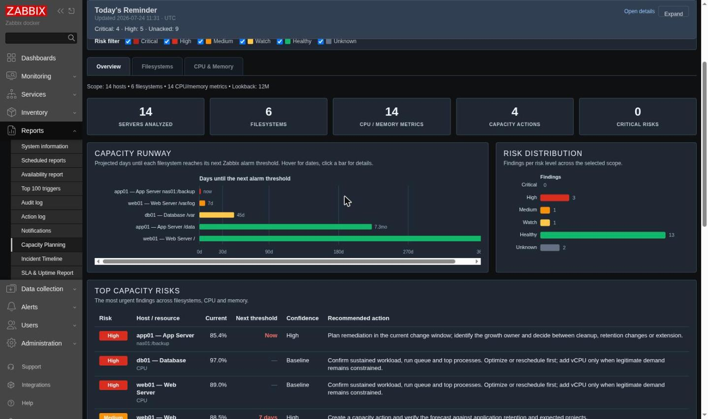
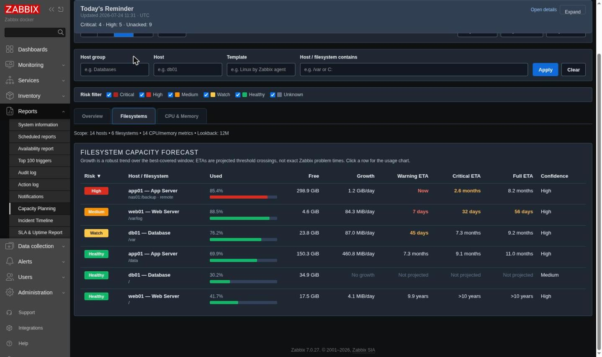
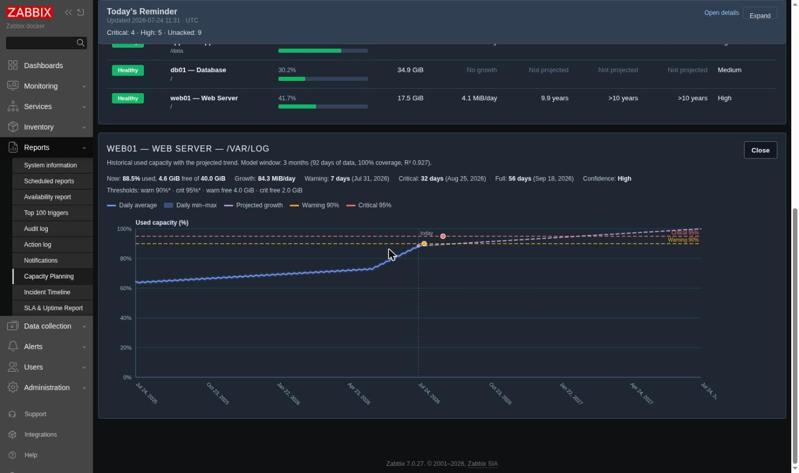
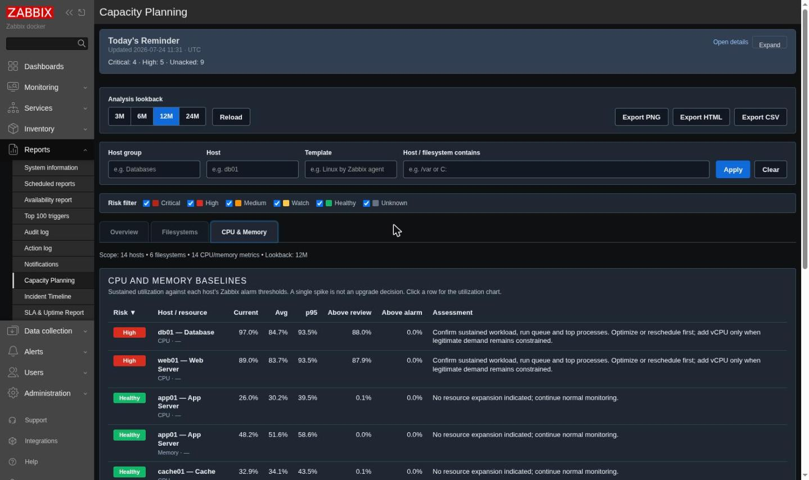

# Capacity Planning & Prediction

A Zabbix **frontend report module** that turns the trend and history data you already collect into an evidence-based capacity report: robust growth forecasts for every filesystem, qualified CPU/memory baselines, confirmed saturation episodes, and risk classifications tied to each host's *actual* Zabbix alarm thresholds — all rendered as interactive charts and sortable tables in the Zabbix UI.

Built and tested on **Zabbix 7.0**.

---

## Quick installation

Zabbix frontend modules must live in their own folder below the frontend's `modules` directory. Deploy only the runtime files shown below — keep the public `tests/` directory out of the web-served module path. After copying, `/usr/share/zabbix/modules/Capacity_Planning/manifest.json` must exist.

Run the copy commands from the parent directory that contains the cloned `Capacity_Planning/` folder (`cd ..` first if your shell is currently inside the repository).

### Linux server (Nginx + PHP-FPM, SELinux)

The commands below match a package installation whose frontend service user is `nginx`. Keep the PHP module code root-owned and read-only to the web process; only the cache directory is owned by PHP-FPM. Change the cache owner `nginx:nginx` if `ps -eo user,group,comm | grep php-fpm` shows a different PHP-FPM user.

```bash
sudo dnf install -y policycoreutils-python-utils  # provides semanage on RHEL/Rocky/Alma

MODULE_SOURCE=./Capacity_Planning
MODULE_DIR=/usr/share/zabbix/modules/Capacity_Planning
CACHE_DIR=/var/cache/zabbix-capacity-planning

sudo install -d -o root -g root -m 0755 "$MODULE_DIR"
sudo cp -a "$MODULE_SOURCE/Module.php" "$MODULE_SOURCE/manifest.json" \
  "$MODULE_SOURCE/actions" "$MODULE_SOURCE/assets" "$MODULE_SOURCE/lib" \
  "$MODULE_SOURCE/views" "$MODULE_DIR/"
# Remove tests left by an older whole-repository deployment.
sudo rm -rf -- "$MODULE_DIR/tests"

sudo chown -R root:root "$MODULE_DIR"
sudo find "$MODULE_DIR" -type d -exec chmod 0755 {} +
sudo find "$MODULE_DIR" -type f -exec chmod 0644 {} +
sudo install -d -o nginx -g nginx -m 0700 "$CACHE_DIR"

sudo semanage fcontext -a -t httpd_sys_content_t '/usr/share/zabbix/modules/Capacity_Planning(/.*)?'
sudo semanage fcontext -a -t httpd_sys_rw_content_t '/var/cache/zabbix-capacity-planning(/.*)?'
sudo restorecon -Rv "$MODULE_DIR" "$CACHE_DIR"
```

The terminating `+` in both `find -exec` commands is intentional. If you prefer the one-file-at-a-time form, the semicolon must be escaped as `{} \;`; a bare `{} ;` is consumed by the shell and produces `find: missing argument to -exec`.

The two `semanage fcontext -a` commands are for a first installation. If a rule already exists during an upgrade, rerun that command with `-m` instead of `-a`, then run `restorecon` again.

Add these lines inside the Zabbix PHP-FPM pool (commonly `/etc/php-fpm.d/zabbix.conf` on RHEL-family systems):

```ini
env[CAPACITY_PLANNING_CACHE_DIR] = /var/cache/zabbix-capacity-planning
env[CAPACITY_PLANNING_CACHE_NAMESPACE] = test-zabbix
env[CAPACITY_PLANNING_FRONTEND_ROOT] = /usr/share/zabbix
```

Use a stable namespace unique to this Zabbix installation; see [Deployment namespace](#deployment-namespace). Then reload PHP-FPM and Nginx:

```bash
sudo systemctl restart php-fpm nginx
```

`httpd_can_network_connect` is not a special requirement of this module. Keep your existing SELinux boolean if the Zabbix frontend needs it to reach a networked database or other Zabbix component; do not enable the broad boolean solely for the disk cache.

### Docker Compose

The official Zabbix 7.0 web image runs as UID/GID `1997:1995`. Run these commands from the directory containing both `Capacity_Planning/` and your Compose file (Compose resolves relative bind paths from its project directory). First build a runtime-only bind-mount directory, then create the private cache directory:

```bash
RUNTIME_DIR=./Capacity_Planning-runtime
rm -rf -- "$RUNTIME_DIR"
mkdir -p "$RUNTIME_DIR"
cp -a ./Capacity_Planning/Module.php ./Capacity_Planning/manifest.json \
  ./Capacity_Planning/actions ./Capacity_Planning/assets ./Capacity_Planning/lib \
  ./Capacity_Planning/views "$RUNTIME_DIR/"

mkdir -p ./zabbix-capacity-cache
sudo chown 1997:1995 ./zabbix-capacity-cache
sudo chmod 0700 ./zabbix-capacity-cache
find "$RUNTIME_DIR" -type d -exec chmod 0755 {} +
find "$RUNTIME_DIR" -type f -exec chmod 0644 {} +
```

Add these entries to the existing Zabbix **web frontend** service (MySQL or PostgreSQL; Nginx or Apache):

```yaml
services:
  zabbix-web-nginx-mysql: # replace with your actual frontend service name
    volumes:
      - ./Capacity_Planning-runtime:/usr/share/zabbix/modules/Capacity_Planning:ro
      - ./zabbix-capacity-cache:/var/cache/zabbix-capacity-planning:rw
    environment:
      CAPACITY_PLANNING_CACHE_DIR: /var/cache/zabbix-capacity-planning
      CAPACITY_PLANNING_CACHE_NAMESPACE: test-zabbix
      CAPACITY_PLANNING_FRONTEND_ROOT: /usr/share/zabbix
```

On an SELinux Docker host, use `:ro,Z` and `:rw,Z` on those two bind mounts for one frontend container. Use shared `:z` labels only when multiple containers intentionally mount the same paths. Recreate the frontend container so the mounts and environment are applied:

```bash
docker compose up -d --force-recreate zabbix-web-nginx-mysql
```

For either installation, finish in **Administration → General → Modules**: press **Scan directory**, then enable **Capacity Planning & Prediction**. Open **Reports → Capacity Planning**, and check **Settings** to confirm that the cache backend is available. The report still works from live Zabbix data if the private cache cannot be initialized.

### Deployment namespace

`CAPACITY_PLANNING_CACHE_NAMESPACE` is a non-secret, stable label used to prevent cached item IDs from one Zabbix installation being mistaken for item IDs from another installation.

- Choose a short unique value such as `test-zabbix`, `prod-eu-zabbix` or `customer-a-prod`. Do not put a password, token, hostname inventory or other secret in it.
- All frontend nodes that connect to the **same Zabbix database** may use the same namespace. Prefer a private local cache directory per frontend node. Intentional cross-node reuse additionally requires the same managed `CAPACITY_PLANNING_BOOT_ID`, the same numeric PHP-FPM UID, POSIX ownership/mode preservation, working cross-node `flock`, and atomic same-directory rename semantics on the shared filesystem. Without the shared generation value, each node automatically keeps its own boot-scoped generation even inside a shared directory.
- Frontends connected to different Zabbix databases must use different namespaces, even if item IDs happen to overlap.
- Keep the value stable across ordinary upgrades and restarts. Changing it starts a new logical namespace, but the module cannot visit the old namespace to clean it. Clear the shared cache **before** changing the value; if it was already changed, verify and remove the old private namespace directory manually.
- If no explicit value is configured, the module derives a hashed namespace from the initialized Zabbix database connection. If that identity is incomplete or untrustworthy, caching fails closed instead of using a generic shared namespace.
- Containers may additionally set `CAPACITY_PLANNING_BOOT_ID` to a trustworthy deployment generation and rotate it when the frontend/Zabbix stack is recreated. It is required for intentional cross-node shard reuse. On a normal single-node Linux server the module uses the operating-system boot identity automatically. A Zabbix-service-only restart has no dependable frontend API epoch, so use **Refresh now** or **Clear shared cache** when a full rebuild is required.
- `CAPACITY_PLANNING_FRONTEND_ROOT` is an optional authoritative frontend or alias root. Set it when the frontend is mounted or symlinked through a layout the module cannot infer. The cache is rejected if its path overlaps this root in either direction; the examples set `/usr/share/zabbix` explicitly.

## Screenshots



The **Overview** tab: scope cards, the capacity-runway chart (days until each filesystem reaches its next alarm threshold), the risk distribution and the most urgent findings.



The **Filesystems** tab: per-filesystem growth, warning/critical/full ETAs and confidence. Note the context-aware thresholds — `/var` warns at its host-macro override, the remote NFS share uses the stricter remote defaults.



Clicking a row opens the usage chart in a modal window: daily min–max band, average line, the projected growth crossing the host's own warning/critical threshold lines, with crossing markers and dates. Drag across historical data to zoom into a smaller range.



The separate **CPU** and **RAM** tabs: sustained utilization against each host's alarm thresholds — average, p95 and time-above-threshold, with a drill-down chart per metric.

## Features

- **Real disk forecasting, not just charts** — a robust Theil–Sen trend (median of pairwise slopes) is fitted over nested 12-month/6-month/3-month/1-month/1-week windows; the best-qualified window is chosen automatically and a well-supported recent acceleration can shorten the estimate.
- **Conservative filesystem truth** — stale current metrics are excluded, usable capacity prefers `used + free`, Linux `total` is never treated as usable capacity by itself, and direct `pused` history drives percentage ETAs when available while byte growth independently drives free-space ETAs. Current breaches remain visible even when there is too little history to fit a model.
- **ETAs to the thresholds that actually alarm** — warning/critical percentage macros (`{$VFS.FS.PUSED.MAX.WARN/CRIT}` with `label(name)`/FSNAME contexts, regex contexts included) and absolute free-space macros are resolved with real Zabbix precedence: host → template chain by depth → global. Fallback defaults are used only when no macro resolves, and every fallback is reported.
- **Risk classification** — every finding is classified Critical / High / Medium / Watch / Healthy / Unknown from current breaches, projected ETAs and forecast confidence, so the report leads with what needs action.
- **CPU & memory need from sustained evidence** — coverage-qualified 7-day to 12-month baselines combine average, p95, peak and sample-weighted time above warning/critical thresholds. Sparse evidence stays `Unknown`; a single spike is never presented as proof that capacity must be added.
- **Confirmed saturation episodes** — the most recent 31 days of raw resource history are bucketed to five minutes. Duration is counted only for sufficiently covered buckets with multiple samples, while recurrence, distinct days, longest episode, total duration and near-full peaks are reported separately.
- **Regime-change isolation** — a persistent recent increase or decrease can replace an older baseline, while pre-change saturation remains visible as historical evidence instead of distorting current need.
- **Capacity runway chart** — one glance shows which filesystems cross a threshold in the next year, colored by risk.
- **Interactive modal drill-down** — open any row without leaving or scrolling down the report. The keyboard-accessible modal contains the full evidence and historical chart with min–max band, projection, threshold lines, crossing markers, hover tooltips and drag-to-zoom.
- **Fast filters & deep links** — Inventory scope previews permission-filtered host group / host / template matches while you type and accepts comma-separated contains terms or explicit regular expressions, plus instant host group, exact host, resource type, data-status, name and capacity-risk filters. Filter state is kept in the URL for bookmarking and sharing.
- **Compact long lists** — main tables default to 25 rows with 25/50/100 row pagination, sticky headings, exact result counts, and a shorter CPU/RAM evidence table; the complete evidence remains in the modal and exports.
- **Separate CPU and RAM workspaces** — each resource has its own tab, filters, deep link and CSV export while reusing the same loaded inventory.
- **Maintenance-aware current state** — active maintenance is visible in tables, exports and detail windows. Maintenance without data collection labels values as last accepted and cannot turn an old value into a current alarm; gaps that pre-date maintenance remain data-quality warnings.
- **Permission-safe shared series cache** — anonymous numeric trend/history shards can be reused between authorized users, but every requested item is re-authorized through Zabbix before a cache read. Host names, groups, inventory, thresholds, current state, forecasts and recommendations are never cached.
- **Exports** — CSV (action list, full filesystem forecast, resource baselines), a standalone HTML report and PNG chart export. CSV output neutralizes spreadsheet formula injection.
- **Dark theme** — every surface has `dark-theme` and `hc-dark` styling. Charts read the palette at render time, so they pick up the dark palette the next time they are drawn (switching the Zabbix theme reloads the frontend anyway).

## Built for scale

- The report loads progressively: the inventory (items, thresholds, current state) renders first, then forecasts stream in small batches with the riskiest filesystems computed first.
- Trend series are fetched per item with hard row caps, sorted before analysis and downsampled to daily points before they reach the browser.
- CPU and memory additionally fetch up to 31 days of raw history in five-minute buckets. Recent history replaces an hourly trend bucket for baseline math only when that hour has enough coverage; sparse buckets can still show peaks but cannot invent sustained duration.
- CPU/RAM forecasts use smaller request batches than disk forecasts so the high-resolution evidence stays within practical frontend memory and timeout limits.
- The server cache is split into calendar shards. Expanding 3M to 6M or 12M reuses authorized shards and loads the missing range. The 15/30/60-minute setting is a refresh interval for mutable current-day/current-month shards only: it controls when newer samples are loaded, and is **not** a retention or deletion timer. Historical shards remain stored until age/size cleanup or a manual clear. An operating-system generation change stops reusing the older generation, whose files then remain protected until cleanup removes them.
- Completed lookback results are also kept for the lifetime of the open page, so returning to an already calculated range is immediate.
- Instant display filters, sorting and pagination reuse the loaded analysis; only changing the inventory scope or pressing **Refresh now** repeats discovery.
- Hosts, items, findings and data-quality lists all have named caps; when a cap is hit the UI says so instead of silently truncating.
- If an item has no hourly trends, a bounded raw-history fallback (7 days, bucketed hourly) is used and marked as low-confidence.

> Forecast dates are planning estimates, not guarantees. The ETA is the projected threshold crossing — not the exact moment a Zabbix problem event fires (triggers may require sustained breaches).

## Usage

- The default **analysis lookback** is 3M. Presets are 3M / 6M / 12M; **Custom** accepts 7–730 days ending today. The forecast itself always projects up to one year ahead.
- Use **Inventory scope** to reduce what Zabbix loads and analyzes. Plain text is a case-insensitive contains match. Separate alternatives with commas (for example `Databases, SAP`) or use an explicit regular expression such as `/^prod-(eu|us)-\d+$/i`; supported flags are `i`, `m`, `s`, `u` and `x`. Alternatives within one field are ORed; host group, host and template fields are ANDed together. Permission-filtered matches appear while you type, but the full analysis reloads only when you select **Apply scope**. A literal comma can be written as `\,`; suggestions add the required escaping automatically.
- Use **Displayed results** to filter the loaded report instantly by search text, exact host group, exact host, resource type or data status. These filters also control overview counts and exports.
- The **capacity risk** checkboxes filter calculated Critical / High / Medium / Watch / Healthy / Unknown results. **Action required** selects Critical, High and Medium in one click.
- Use the **CPU** and **RAM** tabs to work with one resource class at a time. Existing `tab=resources` bookmarks are redirected to CPU.
- Open a runway bar or table row to show the detail modal. Drag across the historical timeline to zoom, and use **Reset zoom** to return to the full chart. `⚠` in the Filesystems table's Confidence column means recent growth is accelerating beyond the long-term model; the detail modal shows the same signal as "(accelerating)" and the CSV export carries it in its own column.
- **Export CSV** exports the active tab (Overview → action list); **Export HTML** produces a self-contained report; **Export PNG** exports the open detail chart, or falls back to the Overview runway and risk-distribution charts when no detail window is open.
- All report state is deep-linkable: `lookback` (7–730 days), `tab` (`overview`/`disks`/`cpu`/`memory`/`settings`; `resources` redirects to `cpu`), the scope fields `group`/`host`/`template`, and the display filters `name`, `result_group`, `result_host` (host ID), `type`, `status`, `rows` (25/50/100) and `risks` (comma-separated list, or `none`). Bookmarks restore the exact filtered view.
- The scope suggestion list is keyboard-accessible: ArrowDown opens it and focuses the first match, ArrowUp/ArrowDown cycle, Enter applies the highlighted suggestion and Escape returns to the input.
- CPU/RAM recommendations describe the evidence and urgency. Provisioned vCPU/RAM is shown for context, but the module does not claim an exact amount to add from utilization percentages alone.
- **Settings** is intentionally small: a Super admin can turn the shared cache off or choose a 15/30/60-minute recent-shard refresh interval, inspect its health and clear it. The interval never clears historical cache files. Disabled hosts are always excluded and maintenance behavior is automatic, so neither needs a setting.

## Cache security and deployment

- The cache is server-side disk storage. Without `CAPACITY_PLANNING_CACHE_DIR`, the module creates its own private child below PHP's temporary directory; the production examples use the dedicated `/var/cache/zabbix-capacity-planning` path. It requires private directories (`0700`) and files (`0600`), rejects symbolic links and unsafe/web-accessible paths, and falls back to live Zabbix reads if those checks fail.
- Prefer a dedicated `CAPACITY_PLANNING_CACHE_DIR` on multi-user hosts. The fallback path below the world-writable system temporary directory has a predictable name, so another local OS user could pre-create it; the ownership checks then fail closed — cached data is never exposed, but the report permanently runs on live reads until the directory is reclaimed or a dedicated path is configured.
- Cached files contain numeric item series only. Filenames are hashed, and a live permission-filtered `item.get` check happens before any shared value can be returned to the current user.
- The cache has bounded size and opportunistic age/size cleanup. The default age threshold is 30 days (overridable with `CAPACITY_PLANNING_CACHE_MAX_IDLE_SECONDS`); it is separate from the 15/30/60-minute recent-shard refresh interval and is not an exact purge schedule. Large manual clears are processed in bounded server requests; the browser continues those requests from the same **Clear shared cache** click and reports the accumulated number removed. A cache-schema change or operating-system boot selects a new generation automatically. Because the frontend API does not provide a dependable Zabbix-server service start identifier, a service-only restart is handled with **Refresh now** or **Clear shared cache** when a rebuild is required.
- Set `CAPACITY_PLANNING_CACHE_DIR` to use a dedicated private cache directory, `CAPACITY_PLANNING_CACHE_NAMESPACE` to identify the Zabbix deployment, and `CAPACITY_PLANNING_FRONTEND_ROOT` when an additional frontend/alias root must be excluded. Use `CAPACITY_PLANNING_BOOT_ID` in containers if the orchestrator can rotate a trustworthy generation value on restart, and use the same value for intentional cross-node cache sharing. Size and idle limits can be set with `CAPACITY_PLANNING_CACHE_MAX_BYTES` and `CAPACITY_PLANNING_CACHE_MAX_IDLE_SECONDS`.
- Database and PHP-session caching are deliberately avoided: they normally remain plaintext too, enlarge the Zabbix database or session store, and do not provide the same bounded shared-series behavior. Turn the cache **Off** if local policy forbids protected numeric data on disk; report calculations remain the same and only loading time changes.

## Notes / limits

- Any Zabbix user can open the report; API permissions decide which hosts and items each user sees, so two users can legitimately get different reports. Disabled hosts are excluded before inventory and forecast discovery.
- Inventory scope accepts at most 20 values in total, including at most five regular expressions. Resolution is capped at 5,000 permission-visible matches; if completeness cannot be proven, **Apply scope** is blocked and the UI asks for a narrower expression instead of analyzing a partial allow-list.
- Filesystem discovery covers `vfs.fs.size[...]` and `vfs.fs.dependent.size[...]` keys (used/free/total/pused/pfree); CPU/memory discovery covers `system.cpu.util`, `vm.memory.utilization`, `vm.memory.util`, `vm.memory.size[pused|pavailable|total]` and the `vm.cpu.util`/`vm.mem.util` shorthand keys. Windows perf-counter-only CPU items are not yet recognized.
- Forecasts need numeric (float/uint) items; Zabbix housekeeping limits how far back the analysis can look. Raw history is fetched newest-first with a 50k-row cap, so a safety-limit truncation preserves the evidence closest to now and explicitly reports that older samples were omitted.
- Threshold macros are resolved with `nopermissions` so every user sees the thresholds the server actually alarms on, even when the defining template is not readable to them; only text macros matching the threshold-name prefixes are read, and secret/vault macros are skipped.
- Threshold macros with secret/vault values cannot be read and fall back to defaults (reported under Data quality).
- Conflicting threshold macros inherited from templates at the same depth follow Zabbix 7 precedence: the value from the lowest numeric template ID wins. Ambiguity is reported only when multiple matching candidates remain on that same winning entity.
- Template ancestry is fetched only for templates reachable from the analyzed hosts, in bounded batches with cycle protection. If the explicit safety limit or an incomplete API response prevents full traversal, the Data quality tab reports that macro precedence may be incomplete instead of silently presenting the fallback as authoritative.
- Remote filesystems (NFS/CIFS/…) are classified and get the stricter remote defaults when no macro resolves; block-device I/O saturation is out of scope for this module.

## Calculation regression tests

The tests remain in the public source repository for review and development, but they are non-web test runners and are intentionally excluded by the production installation commands above.

The pure calculation suite covers sparse resource data, isolated maxima, recurring saturation episodes, downward regime changes, invalid percentages, Linux/Windows usable-capacity rules, freshness-first item/family selection, sparse disk history, current disk breaches without a model, and same-depth macro precedence:

```bash
php tests/CapacityPlanningMathTest.php
```

The cache suite covers authorization-before-cache access, namespace failure behavior, range completeness, future-range rejection, incremental extension, private storage, restart generations and the hard storage quota. Its full disk round-trip runs on a POSIX filesystem:

```bash
php tests/CapacityPlanningCacheTest.php
```

The browser regression test covers Settings permissions and lazy loading, live multi-value/regex scope previews, pagination, instant facets, risk filtering, modal keyboard behavior, focus restoration, no-scroll opening, drag-to-zoom and custom lookback. It requires Node.js, Playwright and a Chromium/Chrome executable:

```bash
node tests/CapacityPlanningUiTest.cjs
```
