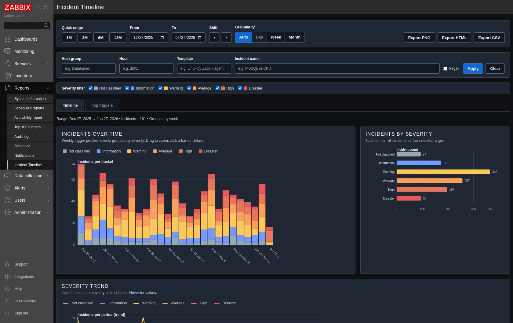
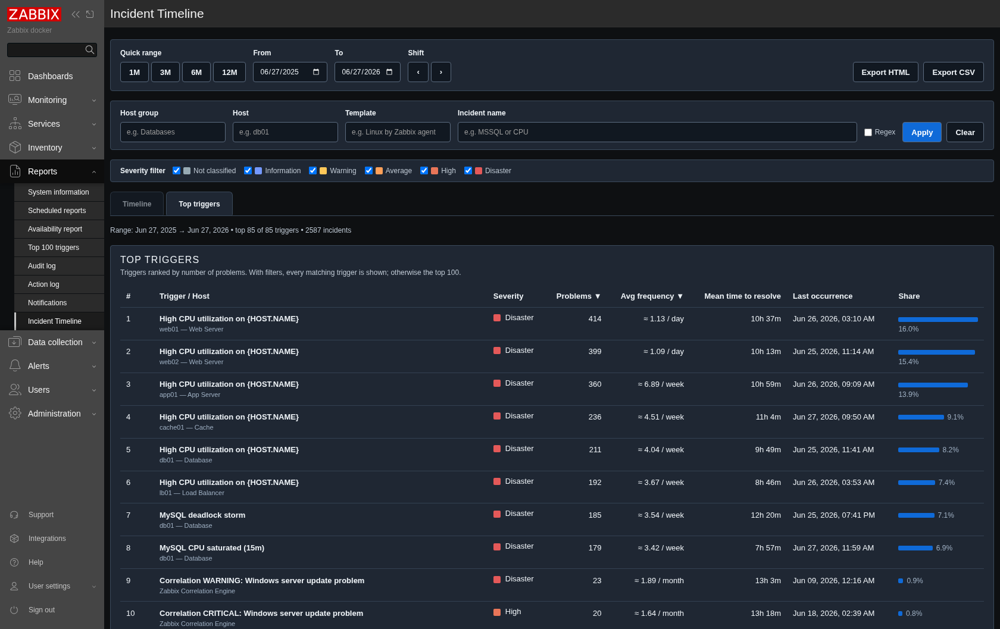
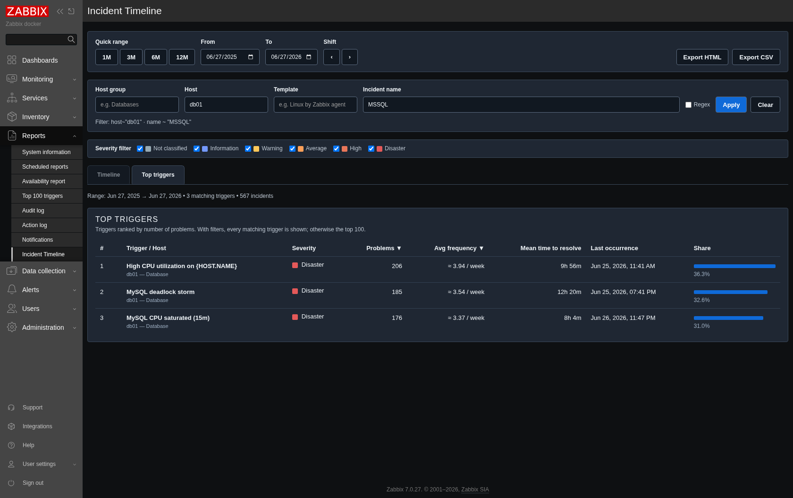

# Incident Timeline Graph

A Zabbix **frontend report module** that visualises trigger problem events over time and ranks the
noisiest triggers — with multi‑month ranges, interactive charts, host/group/template/name filtering
and HTML/CSV/PNG export. It appears under **Reports → Incident Timeline**.

Built and tested on **Zabbix 7.0**.

---

## Screenshots

**Timeline** — daily/weekly/monthly incident volume by severity, with an at‑a‑glance severity
breakdown and trend lines. Drag on the chart to zoom, click a bar to drill into that period.



**Top triggers** — every trigger ranked by problem count, with **average firing frequency**
(auto‑scaled per second/minute/hour/day/week/month), **mean time to resolve**, last occurrence and
share of total. With no filter it shows the top 100; with a filter it shows *every* matching trigger.



**Filtered** — the same filters apply to both tabs, so you can answer questions like *"all MSSQL
incidents on db01"* or *"all Kubernetes incidents in this cluster"*. Incident‑name matching supports
substrings or full regular expressions.



---

## Features

- **Multi‑month ranges** — quick presets (1M/3M/6M/12M), free From/To dates, and a window shift.
  The range cap is ~25 months.
- **Automatic bucketing** — day / week / month is chosen from the range length (or forced via the
  Day/Week/Month toggle) so the chart stays readable whether you look at a week or two years.
- **Interactive charts** (hand‑rolled SVG, no external libraries):
  - hover tooltip with the per‑severity breakdown + column highlight / trend crosshair,
  - **drag‑to‑zoom** into a sub‑range,
  - **click a bar to drill down** into that period's individual incidents (lazy‑loaded),
  - clickable legend that mirrors the severity checkboxes.
- **Top triggers tab** — ranked by problem count, with average frequency, mean‑time‑to‑resolve,
  last occurrence and a share bar. Sortable columns. Top 100 by default, *all matches* when filtered.
- **Filters shared across both tabs** — host group, host, template (all substring‑matched) and
  incident name (substring **or regex**), plus the severity checkboxes.
- **Exports** — PNG (charts), HTML (standalone report) and CSV (incident detail, or the top‑triggers
  table). CSV is hardened against spreadsheet formula injection.
- **Dark / high‑contrast theme** aware.
- **Deep‑linkable** — the range, granularity, tab and filters live in the URL.

---

## Built for scale

On large instances a single trigger can fire hundreds of thousands of times a month, so the module
avoids transferring raw event rows wherever possible:

- The **timeline chart never ships event rows** — it asks the database for per‑bucket **counts** per
  severity (`event.get` with `countOutput`). A year of data is a few KB instead of megabytes.
- Counts load **progressively, most‑severe first** (Disaster → … → Information), each severity as its
  own small request, so users see the important data immediately even when the full load takes a
  while — and each request is small, which reduces the chance of hitting a web‑server timeout.
- The **Top triggers** report must scan events to group them by trigger; it is capped (200k events
  per request) and shows a clear "results may be partial" warning when the cap is hit. Narrowing the
  range or adding a filter makes it exact again.

> Note on "request limits": Zabbix's *Limit for search and filter results* setting does **not** cap
> `event.get` calls that pass their own limit (this module paginates internally). The practical limits
> at very high volume are PHP `max_execution_time` / `memory_limit` and the web server / PHP‑FPM read
> timeout — the count‑based, progressive design above is what keeps those in check.

---

## Install

1. Copy the `Incident_timeline_graph` folder to the Zabbix **web frontend** server under:
   `/usr/share/zabbix/modules/`
2. Fix permissions (adjust the web user — `nginx`, `www-data`, …):
   ```bash
   sudo chown -R nginx:nginx /usr/share/zabbix/modules/Incident_timeline_graph
   sudo find /usr/share/zabbix/modules/Incident_timeline_graph -type d -exec chmod 755 {} \;
   sudo find /usr/share/zabbix/modules/Incident_timeline_graph -type f -exec chmod 644 {} \;
   ```
   On SELinux systems:
   ```bash
   sudo semanage fcontext -a -t httpd_sys_content_t '/usr/share/zabbix/modules/Incident_timeline_graph(/.*)?'
   sudo restorecon -Rv /usr/share/zabbix/modules/Incident_timeline_graph
   ```
3. In the frontend go to **Administration → General → Modules**, click **Scan directory**, then
   enable **Incident Timeline Graph**.
4. Open **Reports → Incident Timeline**.

Any Zabbix user can view it; the data shown respects each user's host permissions.

---

## Usage

- Pick a range (preset or From/To), optionally set the granularity, and switch between the
  **Timeline** and **Top triggers** tabs.
- Use the filter bar to scope by host group, host, template and/or incident name (tick **Regex** for
  regular‑expression name matching). The same filter drives both tabs.
- On the timeline: hover for details, drag to zoom (then **Reset zoom**), click a bar to list that
  period's incidents.
- Export the current view as PNG, HTML or CSV.

---

## Notes / limits

- Times are bucketed in **UTC**.
- Maximum range ~768 days; per‑request event scan cap 200,000 (only the Top‑triggers/incident/CSV
  paths scan rows — the timeline uses counts).
- Exports are HTML/CSV/PNG only (no extra PHP libraries are bundled into the frontend).
- If the page is blank after install, check the PHP‑FPM / Nginx / Apache error log for the fatal error.
