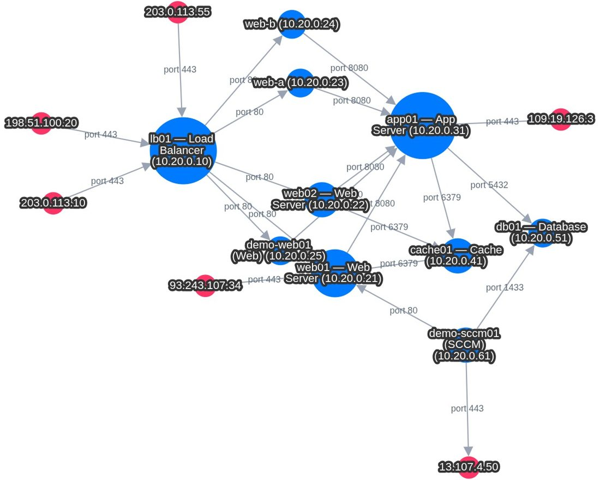
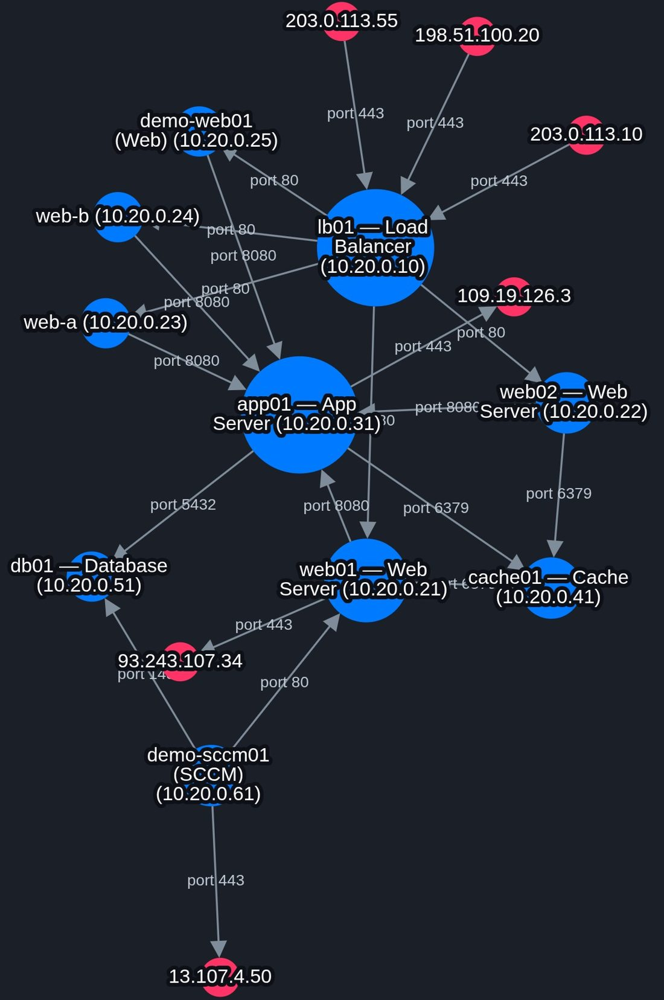

# Network Map - Zabbix frontend module

This is a native Zabbix frontend module rewrite of the original standalone FastAPI-based
network map application.

This package is the **Zabbix-only** variant:

- Menu entry: **Monitoring -> Network map**
- Native Zabbix action/controller/view structure
- Uses the logged-in Zabbix user's permissions through the frontend API
- No separate Zabbix API token needed
- No NetBox dependency
- Host labels come from Zabbix hosts
- Cytoscape-based graph rendering is kept

## What it shows

The map renders the **established TCP connections** between hosts monitored by
Zabbix. Every monitored host is a node, and every observed connection is a
**directional edge labelled with the service port**. Endpoints that resolve to a
Zabbix host (by interface IP) are drawn as monitored nodes; anything else is
shown as a private or external endpoint. Node size scales with the number of
connections, so busy hubs stand out at a glance.



### Node colors

| Color | Meaning |
|---|---|
| 🔵 Blue | Monitored Zabbix host (resolved by interface IP) |
| ⚪ Gray | Private IP that is not resolved to a monitored host |
| 🔴 Red | External / public IP endpoint |

### Filtering

The toolbar lets you focus the graph without rebuilding it:

- **Host scope** — leave empty for the full graph, or pick a host to show only
  the traffic where it is the source or destination.
- **Source / Destination filters** — match by hostname or IP. Multiple
  comma-separated values are supported and matching is a case-insensitive
  substring, so `web` matches `web-server-01`.
- **Port filter** — single ports, ranges, and exclusions, comma-separated:
  `443`, `80-443`, `443,8080,3306`, `!135`.
- **Hide RPC / high ports** and **Exclude public IPs** toggles to declutter the
  view, plus **History (days)**, **Minimum separation**, and horizontal/vertical
  scale controls for layout.

The view follows the active Zabbix theme, including dark mode:



## Requirements

- Zabbix frontend with frontend module support
- The connection data already present in Zabbix items named:
  - `linux-network-connections`
  - `windows-network-connections`
- Download plugins here: https://github.com/Keberneth/Zabbix-Plugins
- Web server / php-fpm user must be able to read the module files
- Web server / php-fpm user must be able to write to the configured cache directory

# Download Zabbix plugin and template here
https://github.com/Keberneth/Zabbix-Plugins

## Installation

### 1. Copy the module directory into the Zabbix frontend modules directory

Use the module directory name exactly as provided:

```bash
cp -a NetworkMap /usr/share/zabbix/modules
```

Examples:

- Typical package/appliance frontend root: if your frontend root is `/usr/share/zabbix`,
  the module directory is usually `/usr/share/zabbix/modules/NetworkMap`

### 2. Set ownership and permissions

Example using an nginx or php-fpm web user:

```bash
mkdir -p /var/lib/zabbix/network-map-cache
chown -R nginx:nginx /var/lib/zabbix/network-map-cache
chmod 0770 /var/lib/zabbix/network-map-cache

find /path/to/zabbix-frontend/modules/NetworkMap -type d -exec chmod 0755 {} \;
find /path/to/zabbix-frontend/modules/NetworkMap -type f -exec chmod 0644 {} \;
```

On SELinux systems (RHEL/Rocky/Alma), also label the module directory:

```bash
sudo semanage fcontext -a -t httpd_sys_content_t '/usr/share/zabbix/modules/NetworkMap(/.*)?'
sudo restorecon -Rv /usr/share/zabbix/modules/NetworkMap
```

If your web user is `www-data`, `apache`, or something else, adjust the ownership accordingly.

### 3. (Optional) Create a local configuration override

The module works out of the box with built-in defaults. To customise the cache
directory, history window, item names, or colors, copy the bundled example and
edit it:

```bash
cp /usr/share/zabbix/modules/NetworkMap/config.local.php.example \
   /usr/share/zabbix/modules/NetworkMap/config.local.php
```

`config.local.php` is git-ignored, so per-environment settings are never
committed back. See the [Configuration reference](#configuration-reference)
below for every available key.

### 4. Register and enable the module in Zabbix

1. Log in as a **Super admin**
2. Open **Administration -> General -> Modules**
3. Click **Scan directory**
4. Find **Network Map**
5. Click **Disabled** to enable it

### 5. Open the map

After enabling, the menu entry appears here:

- **Monitoring -> Network map**

## Operational notes

### Permissions

The map uses the logged-in user's Zabbix frontend permissions when reading hosts/items/history
through the internal frontend API. The module also uses a per-user map cache key to reduce
the chance of serving one user's cached graph to another user.

### Host naming

The default and recommended setting is:

```php
'host_label_source' => 'visible'
```

That gives you the host visible name on the map. If you prefer the technical host name,
set it to:

```php
'host_label_source' => 'technical'
```

### Performance

This module rebuilds the graph from recent history and then caches the result. If your
connection items are very high-volume, start with the defaults and only increase
`history_limit_per_item` when needed.

### If the module does not show up

Check these first:

- `manifest.json` exists directly under `NetworkMap/`
- the module is in the correct `modules/` directory
- the web server user can read the directory tree
- owner and permissions are correct on folders and files

## Configuration reference

All settings are optional. Resolution order is: built-in default →
`NETWORK_MAP_*` environment variable → value in `config.local.php` (if present).

| Config key (`config.local.php`) | Default | Environment override | Description |
|---|---|---|---|
| `cache_dir` | `sys_get_temp_dir() . '/network-map'` | `NETWORK_MAP_CACHE_DIR` | Writable directory for the built-map disk cache. Must be writable by the web/php-fpm user. |
| `cache_ttl_seconds` | `1800` | `NETWORK_MAP_CACHE_TTL_SECONDS` | How long a built map is served from cache before a rebuild. |
| `history_window_hours` | `24` | `NETWORK_MAP_HISTORY_WINDOW_HOURS` | Default history window scanned when building the graph. The frontend can request 1–90 days per load. |
| `history_limit_per_item` | `50000` | `NETWORK_MAP_HISTORY_LIMIT_PER_ITEM` | Max history rows processed per item. A global hard ceiling of 200000 processed rows always applies; `meta.limit_reached` is set when hit. |
| `host_label_source` | `visible` | `NETWORK_MAP_HOST_LABEL_SOURCE` | `visible` = host visible name, `technical` = technical host name. |
| `append_primary_ip_to_host_labels` | `true` | `NETWORK_MAP_APPEND_PRIMARY_IP_TO_HOST_LABELS` | Append the host primary IP to monitored host labels. |
| `zabbix_item_names` | `linux-network-connections`, `windows-network-connections` | — | Item names that carry the connection JSON payloads. |
| `node_color_map` | blue / gray / red | — | Colors for `monitored_host`, `private_ip`, and `external` nodes. |

## Deployment

### Single server

The defaults work as-is; only ensure the cache directory is writable by the web
user (see step 2). No `config.local.php` is required.

### Multi-server frontends

Each frontend node needs its own writable `cache_dir` (or a shared writable
volume). The map cache is per-user and per-window, so a shared volume is safe
but not required. Copy `config.local.php.example` to `config.local.php` on each
node, or set the `NETWORK_MAP_*` environment variables in your php-fpm pool.

### Docker

Mount a writable volume for the cache and point `cache_dir` (or
`NETWORK_MAP_CACHE_DIR`) at it, owned by the container's web user:

```bash
docker run ... \
  -e NETWORK_MAP_CACHE_DIR=/var/cache/network-map \
  -v network-map-cache:/var/cache/network-map \
  ...
```

Make sure the mounted path is writable by the php-fpm/web user inside the
container.

