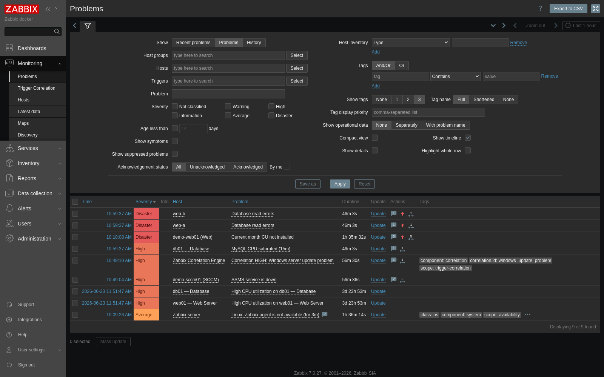
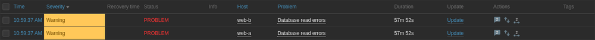

## Simple

This module lets Zabbix create a new synthetic correlation problem when two or more selected trigger problems are active at the same time.

Example:

```text
sccm01: SSMS service is down
+
web01: Current month CU not installed
=
Correlation HIGH: Windows server update problem
```

And later:

```text
sccm01: SSMS service is down - AVARAGE
+
web01: Last month CU not installed - AVARAGE
=
Correlation CRITICAL: Windows server update problem
```

It has a **second feature**, on its own **Severity escalation** tab: instead of
creating a new problem, it **raises the severity of one or more existing
problems** while a correlation condition holds, then restores it when the
condition clears. Example:

```text
when  sccm01: SSMS service is down
then  raise  web01: Current month CU not installed  →  Disaster
      (on that host, a host group, or every host with that problem)
```

This uses Zabbix problem updates (`event.acknowledge`, change-severity action) to
change the **problem (event) severity** — never the trigger's configured priority
— so it is fully reversible and adds the same explanatory comments. See
**Severity escalation rules** below.



A severity escalation in real time: both `Database read errors` problems go from Warning to
Disaster while the MySQL backend is saturated, and back when it recovers.



[SETUP.md](SETUP.md) walks through the rule editors, the settings self-check and the resulting
problems with screenshots of every step.

The module does **not** use `zabbix_sender` and does **not** write directly to the Zabbix database. It uses the Zabbix API:

- `problem.get` to read active trigger problems.
- `history.push` to write `0`, `4`, `5`, etc. to Zabbix trapper items.
- Normal Zabbix triggers on a **correlation host** create and resolve the final correlation problems.

The module **creates those correlation hosts itself** — one per set of source hosts,
e.g. `Correlation: sccm01 + web01` — together with its templates, the engine host
that runs the evaluation and the evaluation secret. You only enter the Zabbix API
URL and an API token.

The default design is:

```text
Zabbix trigger problems
        ↓
Trigger Correlation module
        ↓ history.push
Correlation host (created automatically) trapper items
        ↓
Normal Zabbix trigger prototypes → correlation problem
```

### Files

```text
TriggerCorrelation/
  manifest.json
  Module.php
  actions/
  assets/
  lib/
  views/
  templates/trigger_correlation_receiver_zabbix_7.yaml       (engine host: heartbeat + receiver LLD; imported automatically)
  templates/trigger_correlation_auto_receiver_zabbix_7.yaml  (automatic correlation hosts: receiver LLD only; imported automatically)
  templates/trigger_correlation_manual_item_zabbix_7.yaml    (existing-item mode example)
  README.md
  SETUP_RULES.md
```

> New to building rules? **SETUP_RULES.md** is a step-by-step walkthrough of both
> output modes (with a worked example), and **USE_CASES.md** has full worked
> scenarios for both features (the Windows-update incident and a database-backend
> degradation that escalates a whole web tier to Critical). The module's **Help**
> tab has the same guidance, and every field in the editor has a `?` help button.

### Quick install

Copy the module to the Zabbix frontend modules directory:

```bash
sudo cp -a TriggerCorrelation /usr/share/zabbix/modules/TriggerCorrelation
sudo chown -R root:root /usr/share/zabbix/modules/TriggerCorrelation
sudo find /usr/share/zabbix/modules/TriggerCorrelation -type d -exec chmod 0755 {} \;
sudo find /usr/share/zabbix/modules/TriggerCorrelation -type f -exec chmod 0644 {} \;
```

No writable directory and no database migration are required. The module stores
all configuration and rules in the Zabbix `module` database table (the same place
Zabbix keeps every module's config), so the state is shared by every frontend
node and survives Docker container restarts. This is what makes it work on
single-server, split/multi-frontend and Docker installs alike.

> **Multi-frontend / Docker:** install the module directory on **every** frontend
> node. *Administration → Modules → Scan directory* run on a node that lacks the
> directory deletes the module's database row — and with it all rules and settings.
> (If that happened, re-enable the module, recreate the rules and use **Repair
> automatic setup**: it clears the correlation states and raised severities the lost
> rules left behind.)

Then in Zabbix frontend:

```text
Administration → General → Modules → Scan directory → Enable "Trigger Correlation"
```

Open:

```text
Monitoring → Trigger Correlation → Settings
```

Set the two things the module cannot work out by itself:

```text
Zabbix API URL:   click "Detect" (or type https://your-zabbix.example.com/api_jsonrpc.php)
Zabbix API token: <dedicated API token>
```

That is the whole manual setup. You do **not** import a template, create a host,
link a template or set macros: when you save your first rule the module

- imports its two templates (create-only — an existing template is never changed),
- creates the **engine host** `Zabbix Correlation Engine` (its heartbeat item runs
  the evaluation once a minute),
- generates the **evaluation shared secret**, stores only its hash and writes the
  secret into the engine host's `{$TRIGGER.CORRELATION.TOKEN}` macro (SECRET_TEXT),
- picks the `{$TRIGGER.CORRELATION.URL}` the **Zabbix server** can actually reach —
  it asks the server to fetch candidate addresses (the same test as the item
  "Test" button) and keeps the first one that answers as `eval.php`,
- and creates a **correlation host for the rule's set of source hosts**, e.g.
  `Correlation: sccm01 + web01`, with the receiver template linked. Every rule over
  the same hosts reuses that host.

> **Upgrading from a version where you set this up by hand?** Your rules and your
> hand-made `Zabbix Correlation Engine` keep working unchanged. Click **Settings →
> Repair automatic setup** once to let the module take over that engine host (its
> secret and URL); from then on new rules get automatic correlation hosts. The
> module never takes over a host on its own — anyone with write access to a host
> group could otherwise plant one.

Now create a rule:

```text
Condition 1:
  Host: sccm01
  Trigger: SSMS service is down

Condition 2:
  Host: web01
  Trigger: Current month CU not installed

Output:
  Automatic correlation host (recommended)
  Correlation ID: windows_update_web01_current_cu   (optional — defaults to the rule name)
  Match value: 4 - High
```

Save. The module answers with what it set up ("Created the correlation host
“Correlation: sccm01 + web01”…"), and the first result appears within about two
minutes (Zabbix needs one or two heartbeat runs to discover the new item).

When both source trigger problems are active, the module writes:

```text
trigger.correlation.state[windows_update_web01_current_cu] = 4
```

When either source problem is resolved, it writes:

```text
trigger.correlation.state[windows_update_web01_current_cu] = 0
```

The receiver template trigger prototype creates or resolves the Zabbix problem.

**Dashboard.** The module opens on a live **Dashboard**: every correlation with the
source triggers it watches (grouped per host), its severity right now and the
problem it raised; every severity escalation with the problems it is holding up;
and a **By host** view that shows, per host, which of its triggers feed which
correlations. It refreshes every 30 seconds.

**Clusters.** "One node down is High, both down is Disaster": in the rule editor use
**Add the same trigger from every host in a group** (pick the cluster's host group
and the node-down trigger — one condition per node is added), then click
**Cluster preset** (≥1 active → High, all active → Disaster).

**Something red?** Settings → **Run self-check** shows — from the Zabbix server's own
point of view — whether the heartbeat reaches `eval.php`, whether the API token's
user can see the correlation hosts and whether operators can see their host group.
**Repair automatic setup** fixes most findings: a refused heartbeat gets a new
secret, an unreachable one a server-verified URL, deleted correlation hosts are
recreated, and states/severities left behind by rules that no longer exist (for
example after the module configuration was lost) are cleared.

---

## Full

### What this solves

Zabbix can correlate item values in trigger expressions, but it does not natively create a new higher-severity trigger problem by checking whether two existing trigger problems on two specific hosts are both open.

This module adds that missing workflow while still keeping the final alert as a normal Zabbix trigger problem.

It is designed for cases like:

```text
Patch infrastructure is degraded
+
Specific Windows server is missing CU
=
Higher-severity Windows update incident
```

or:

```text
Database monitoring service problem
+
Application healthcheck problem
=
Critical business service incident
```

### Important design decision

A Zabbix frontend module is PHP code running inside the Zabbix web frontend. It does not run continuously by itself in the Zabbix server process.

To avoid an external daemon and avoid `zabbix_sender`, the **engine host** — created
by the module the first time you save a rule — carries an HTTP agent item:

```text
trigger.correlation.eval
```

That item calls:

```text
modules/TriggerCorrelation/eval.php
```

The module then evaluates all configured rules and uses `history.push` to write values to Zabbix trapper items.

So the runtime loop is still driven by Zabbix itself:

```text
Zabbix server HTTP agent item
        ↓
Zabbix frontend module evaluator endpoint
        ↓
Zabbix API problem.get
        ↓
Zabbix API history.push
        ↓
Correlation host trapper items and trigger prototypes
```

No external binary, no `zabbix_sender`, no direct database event writes.

### Requirements

- Zabbix 7.0 or newer.
- Zabbix frontend modules enabled.
- PHP cURL extension recommended.
- Zabbix API token.
- Rules are saved by a **Super Admin**: the module creates its templates, hosts and
  macros under that session. Nothing has to be prepared in Zabbix by hand.
- Network access from the Zabbix server to the Zabbix frontend (for the once-a-minute
  evaluation). The module checks this from the server's side and picks an address
  that works; see *Evaluation endpoint*.

### API permissions

Use a dedicated API token. The token user needs enough permissions to:

- Read source hosts and source trigger problems.
- Read triggers and hosts for the UI search.
- Write history to the correlation host trapper items through `history.push` (Read on their host group is enough).
- Add problem update comments (`event.acknowledge`) on the source and receiver problems — only required if you enable the comment-injection feature.
- Change problem severity (`event.acknowledge` change-severity action) on the target problems — only required for **Severity escalation** rules. The token user needs "Change severity" permission on those host groups.

The API methods used are:

```text
apiinfo.version
host.get
trigger.get
item.get
problem.get
history.push
event.acknowledge
```

Use the smallest host group permissions possible:

```text
Read access: source host groups
Read access: the correlation host group (by default the engine host's group)
             — Read is enough for history.push and for adding comments
Read-write:  only the groups of problems a severity escalation must change
```

The automatic setup itself (templates, hosts, macros, the evaluation secret) is
done **in-process under the Super Admin who saves the rule**, never with the API
token — so the token user never needs host/template write rights, and the Zabbix
audit log names the admin who made the change. The self-check verifies that the
token's user can see every correlation host and warns when only Super Admins can
see the correlation host group (operators are only shown — and notified about —
problems on hosts their user groups can read). Anyone with write access to the
engine host could repoint its `{$TRIGGER.CORRELATION.URL}` macro; keep that group
restricted.

### Storage

Configuration and rules are stored in the Zabbix database, in the `config`
column of the `module` table row for this module (`id = trigger_correlation`).
There is no config file to manage and nothing to make writable. Because the data
lives in the database, every frontend node and the load-balanced evaluation
endpoint read and write the same shared configuration, and nothing is lost when
an ephemeral/read-only frontend container restarts.

Upgrading from an older file-based version: on first load the module imports an
existing `config.json` (from `ZABBIX_TRIGGER_CORRELATION_CONFIG` or the legacy
`/var/lib/zabbix/modules/trigger-correlation/config.json` path) into the
database once, so your rules and settings are preserved.

### Secret handling

The API token can be stored in the database or read from an environment variable.

Recommended (token never touches the database):

```bash
export ZABBIX_TRIGGER_CORRELATION_API_TOKEN='xxxxxxxxxxxxxxxxxxxxxxxx'
```

Then set this in module settings:

```text
API token env var: ZABBIX_TRIGGER_CORRELATION_API_TOKEN
```

The evaluator shared secret can also be read from an environment variable:

```bash
export ZABBIX_TRIGGER_CORRELATION_EVAL_TOKEN='long-random-secret'
```

Then set:

```text
Evaluation token env var: ZABBIX_TRIGGER_CORRELATION_EVAL_TOKEN
```

By default you set neither: the module generates the evaluation secret, stores a
one-way password hash and writes the secret into the engine host's
`{$TRIGGER.CORRELATION.TOKEN}` (SECRET_TEXT) macro. If you paste a secret in the UI
instead, it is stored as a hash too and copied to the engine host for you — and,
being yours, it is never rotated automatically. A token macro you keep in a secret
vault is never overwritten.

Encryption at rest (optional): if you paste the Zabbix API token into the UI it
is stored in the database. To encrypt it at rest, set a passphrase in the
`ZABBIX_TRIGGER_CORRELATION_ENCRYPTION_KEY` environment variable for the PHP/web
process and re-save settings (AES-256-GCM via libsodium/OpenSSL). On
multi-server/Docker installs set the **same** value on every frontend node so each
can decrypt. With no key set, behavior is unchanged (token stored verbatim).

### Receiver templates

There are two receiver templates. The module imports both on demand (create-only:
an existing template — even one you renamed — is found by its UUID and never
modified) and links them itself; you only need them by hand for the "receiver
host I manage" mode.

| Template | Linked to | Contains |
|---|---|---|
| `Template Trigger Correlation Receiver` (`trigger_correlation_receiver_zabbix_7.yaml`) | the **one** engine host | heartbeat HTTP-agent item + the receiver LLD below |
| `Template Trigger Correlation Auto Receiver` (`trigger_correlation_auto_receiver_zabbix_7.yaml`) | every automatic correlation host | the receiver LLD below only — **no heartbeat**, so N correlation hosts do not mean N evaluations a minute |

The two share item keys, so they can never be linked to the same host. Both keep
items of a rule that disappears from discovery **enabled** until the 30-day LLD
lifetime removes them (`enabled_lifetime_type: DISABLE_NEVER`), so the "clear"
(0) the module pushes for a deleted or disabled rule is always accepted. (An
engine template imported by an older version still has Zabbix's default "disable
immediately"; **Repair automatic setup** switches it.)

**Automatic correlation hosts** are created per *set of source hosts*: technical
name `trigger-correlation-<12-hex key of the sorted host ids>`, visible name
`Correlation: <host> + <host>`, tags `trigger-correlation=auto` and
`tc.hostset=<key>`, no interfaces. When you change a rule's source hosts and no
other rule shares its host, the host is re-keyed in place (history, open problem
and any actions/maintenance bound to it carry over). A host no rule uses any more
gets the tag `tc.unused-since=<unix time>` and is kept with its history; delete it
with Settings → **Delete unused correlation hosts**, or enable automatic deletion
after one day. A host with an open problem is never deleted (deleting its trigger
would never send the "resolved" notification).

The engine/receiver template contains:

```text
HTTP agent item:
  trigger.correlation.eval

Trapper LLD discovery rule:
  trigger.correlation.discovery

Discovered numeric trapper item:
  trigger.correlation.state[{#CORRELATION.ID}]

Discovered text trapper item:
  trigger.correlation.context[{#CORRELATION.ID}]

Trigger prototypes:
  Correlation WARNING:  state = 2
  Correlation AVERAGE:  state = 3
  Correlation HIGH:     state = 4
  Correlation CRITICAL: state = 5
```

The module pushes LLD JSON like this:

```json
{
  "data": [
    {
      "{#CORRELATION.ID}": "windows_update_web01_current_cu",
      "{#CORRELATION.NAME}": "Windows server update problem",
      "{#CORRELATION.DESCRIPTION}": "SCCM SQL service down and current month CU missing on web01"
    }
  ]
}
```

Then it pushes state like this:

```json
{
  "host": "Zabbix Correlation Engine",
  "key": "trigger.correlation.state[windows_update_web01_current_cu]",
  "value": 4
}
```

And context like this:

```json
{
  "host": "Zabbix Correlation Engine",
  "key": "trigger.correlation.context[windows_update_web01_current_cu]",
  "value": "{...json context...}"
}
```

### State values

```text
0 = OK / clear correlation
1 = Information
2 = Warning
3 = Average
4 = High
5 = Critical/Disaster
```

For your examples:

```text
Current month CU missing + SCCM service problem → 4
Last month CU missing + SCCM service problem    → 5
```

### Rule matching

A rule contains two or more source conditions.

Each source condition is:

```text
hostid + triggerid
```

The evaluator calls `problem.get` for each selected trigger and checks only unresolved trigger problems.

By default a rule matches only when **all** source conditions have at least one active problem (match mode `all`). See **Correlation match modes** below for the `any` and `count` modes.

Example rule:

```json
{
  "name": "Windows server update problem",
  "conditions": [
    {
      "host": "sccm01",
      "hostid": "10301",
      "trigger": "SSMS service is down",
      "triggerid": "22110"
    },
    {
      "host": "web01",
      "hostid": "10355",
      "trigger": "Current month CU not installed",
      "triggerid": "22990"
    }
  ],
  "output": {
    "mode": "receiver_lld",
    "receiver_host": "Zabbix Correlation Engine",
    "correlation_id": "windows_update_web01_current_cu",
    "match_value": 4,
    "clear_value": 0
  }
}
```

### Correlation match modes

Each correlation rule has a **match mode** that decides when it fires and at what severity:

- **All conditions active** (`all`, default) — fires `match_value` only when every source condition has an active problem.
- **Any condition active** (`any`) — fires `match_value` when at least one source condition is active.
- **Escalate by active count** (`count`) — the severity rises with how many source conditions are active, using tiers. Example: `≥2 active → High`, `≥3 active → Disaster`. Below the lowest tier the correlation clears (0). The highest tier whose minimum is reached wins.

`count` mode is how you "raise criticality when more related problems pile up" — e.g. select every trigger that reads a given database as conditions, then escalate as more of them go into problem.

Count-mode output excerpt:

```json
"output": {
  "mode": "receiver_lld",
  "match_mode": "count",
  "severity_tiers": [
    { "min": 2, "value": 4 },
    { "min": 3, "value": 5 }
  ]
}
```

In receiver-LLD mode the template ships trigger prototypes for severities 1–5, so every tier level raises a problem.

### Severity escalation rules

This is the module's **second feature**, on the **Severity escalation** tab. It
shares the correlation engine's idea of a *source condition*, but instead of
raising a **new** synthetic problem it **raises the severity of one or more
existing problems** for as long as the condition holds, and **restores** the
original severity when it clears, when the rule is disabled, or when the rule is
deleted.

It changes the **manual event severity** of the matched problems via
`event.acknowledge` (change-severity action 8, optionally with an explanatory
message). It does **not** touch the trigger's configured priority, so:

- it is fully reversible (the original severity is remembered per event and put
  back automatically), and
- a problem that resolves and re-fires returns to its trigger's normal priority.

No receiver template, no LLD, and no extra item are needed for this feature — it
edits problems in place.

A severity escalation rule has:

- **Source conditions** — one or more host + trigger problems (the “when”), with a
  match mode of **all** / **any** / **at least N active** (a single condition is
  allowed, e.g. *“when SSMS service is down”*).
- **Targets** — one or more problems to raise. Each target is a **trigger** plus an
  **Apply to** scope:
  - **This host only** — that exact trigger's active problem(s).
  - **A host group** — every active problem whose name matches that trigger across
    the chosen host group.
  - **All hosts with this problem** — the same, across every host.
- **Escalated severity** — the severity to raise matched problems to, and an
  **Only raise** toggle (never lower a problem that is already more severe).
- **Comments** — comment each escalated problem (why its severity changed) and/or
  cross-link the source problems, exactly like the correlation feature.

Worked example: *raise “Current month CU not installed” to Disaster while
“SSMS service is down” is active*:

```text
When (source trigger):
  Host: sccm01
  Trigger: SSMS service is down

Raise the severity of:
  Target trigger: Current month CU not installed
  Apply to: This host only        (or: A host group / All hosts with this problem)

Escalated severity: 5 - Critical/Disaster
Only raise: on
```

While `SSMS service is down` is active, the matched `Current month CU not
installed` problem(s) are bumped to Disaster with a comment; when SSMS clears,
they drop back to their original severity.

The same per-minute receiver-template heartbeat (`eval.php`) drives both
features, so no extra setup is required beyond the API URL + token. Severity
escalation needs **no** evaluation of `history.push` — only `problem.get`,
`trigger.get` and `event.acknowledge`.

### Problem comments

When a correlation is active the module can inject a comment (a Zabbix problem update — `event.acknowledge` action 4) describing the related triggers in problem:

- **Comment the correlation problem** — a summary on the synthetic correlation problem listing every related trigger currently active (host, trigger, severity, age).
- **Cross-link each source problem** — a note on each source problem that it is part of correlation *X*, naming the other currently-active members.

Comments are throttled by a per-target signature, so they are (re)posted only when the set of active related problems changes — not on every evaluation cycle. The API token user must be allowed to add problem updates on the relevant hosts. Both toggles are per rule (default on); the action code and chunk size live in **Settings → Evaluation behavior**.

### UI behavior

The module page is under:

```text
Monitoring → Trigger Correlation
```

When creating a condition:

- Start typing a host name and the host list filters immediately.
- Select a host, and the trigger field searches only triggers on that host.
- Start typing a trigger first, and the host field can filter to hosts that have matching triggers.
- Select a trigger result, and if the trigger result has a host attached, the host is filled automatically.

This makes it possible to build exact host/trigger correlations without manually looking up IDs.

### Output modes

#### 1. Automatic correlation host (default, recommended)

Nothing to prepare. When you save the rule the module creates — or re-uses — the
correlation host for the rule's **set of source hosts** and links **Template Trigger
Correlation Auto Receiver** to it:

```text
Source hosts sccm01 + web01      →  host "Correlation: sccm01 + web01"
                                     (technical name trigger-correlation-<key>)
Another rule over web01 + sccm01 →  the same host
```

The module then writes to that host:

```text
trigger.correlation.discovery
trigger.correlation.state[<correlation_id>]
trigger.correlation.context[<correlation_id>]
```

and the template's trigger prototypes raise `Correlation HIGH: <rule name>` etc.

- **Correlation ID** — optional; it defaults to the rule name. It becomes the item key
  `trigger.correlation.state[<correlation_id>]` (letters, digits, `_ . -`,
  lower-cased) and must be unique among the rules on the same correlation host.
- Changing the rule's source hosts moves it to the host for the new set; if no other
  rule shares its current host, that host is re-keyed in place so its history and
  open problem carry over.
- The first result appears within about two minutes (Zabbix needs a heartbeat run to
  discover the item); until then the rule shows *Setting up*.

#### 2. A receiver host I manage (advanced)

Use this when the correlation must land on a specific host of yours (one that
represents an integration flow, with its own actions and maintenance). Link
**Template Trigger Correlation Auto Receiver** to it (both templates are imported
automatically once any rule has been saved), then set in the rule editor:

- **Receiver host** — that host's technical name (a **host name**, not a template
  name). Do not link the heartbeat template (**Template Trigger Correlation
  Receiver**) to such hosts — keep exactly one engine host.
- **Correlation ID** — a short unique id **you** choose, e.g.
  `public_web_app_integration_flow`. The module discovers
  `trigger.correlation.state[<correlation_id>]` on the host from it. You do not edit
  the `{#CORRELATION.ID}` prototype in the template — that macro is what makes
  discovery work.

#### 3. My own trapper item (advanced)

Use this if you already have a host/template with a trapper item and trigger.
An example template to clone is `templates/trigger_correlation_manual_item_zabbix_7.yaml`
(a "Zabbix trapper" item plus severity-1–5 triggers).

The module writes the selected value to the selected item.

Example:

```text
Host: Payments Flow
Item key: custom.correlation.windows_update_web01
Value when matched: 1
Value when clear: 0
```

Then your own trigger can be:

```text
last(/Payments Flow/custom.correlation.windows_update_web01)=1
```

### Cloning the templates

Only relevant for the two advanced output modes — automatic correlation hosts need
no template work at all.

- **Receiver templates** (`trigger_correlation_auto_receiver_zabbix_7.yaml`, and the
  engine's `trigger_correlation_receiver_zabbix_7.yaml`) — link as-is.
  Keep the `{#CORRELATION.ID}` macro in the item/trigger prototypes; that is the LLD macro
  discovery fills in from each rule's Correlation ID. Do not hardcode it.
- **Manual item template** (`trigger_correlation_manual_item_zabbix_7.yaml`) — clone it, then
  rename the item key `correlation.escalation[example_flow]` (and the trigger expressions) to
  your own id, e.g. `correlation.escalation[public_web_app_integration_flow]`, and link it to the
  flow host. Use it in *Existing trapper item* mode (select the item), or in *Receiver LLD* mode
  by setting **State key template** to `correlation.escalation[%s]`.

### Resolving and "no data"

- The state item is a **Zabbix trapper** item, so it never becomes *unsupported*; it simply has
  no data until the first evaluation, then the module keeps it populated.
- The module writes the current severity every cycle, including **0 to clear**, so a correlation
  problem resolves automatically when it is no longer true.
- When you **delete** or **retarget** a firing rule, the module pushes a final **0** to its item so
  the correlation problem resolves instead of sticking at the last severity (a false positive).

### Evaluation endpoint

The Zabbix server drives evaluation by calling a **standalone** endpoint every
minute, via the heartbeat HTTP-agent item of the engine host the module set up:

```text
modules/TriggerCorrelation/eval.php
```

**Why a standalone file and not `zabbix.php?action=...`:** the Zabbix server's
HTTP-agent request is *anonymous*, and Zabbix does not route module frontend
actions to anonymous callers when guest frontend access is disabled — it returns
"Page not found" before the action's token check ever runs. `eval.php` connects to
the Zabbix database directly using the frontend's own `zabbix.conf.php` (no login),
so it works regardless of guest access, and is gated by the evaluation token. (The
companion AI module uses the same standalone-entry-point pattern for its webhook.)

It needs no extra web-server config on a standard Zabbix **nginx** install — the
default config already routes `*.php` under the document root to php-fpm, so
`https://<frontend>/modules/TriggerCorrelation/eval.php` just works. On Apache, or a
locked-down nginx that only allows specific PHP files, add a `location`/alias that
routes that one file to PHP (the same approach as the AI module's webhook).

**Which URL the heartbeat uses** is chosen by the module: it asks the Zabbix server
to fetch candidate addresses (the explicit *Evaluation URL* setting, the Frontend
URL from *Administration → General → Other*, the API URL's host, and this web
server's own names) — the same request as the item **Test** button — and writes
the first one that answers as `eval.php` into the engine host's
`{$TRIGGER.CORRELATION.URL}`. If none works it says so; set *Settings → Automatic
setup → Evaluation URL* (in Docker usually the web container's service name, e.g.
`http://zabbix-web:8080/modules/TriggerCorrelation/eval.php`).

Authentication (header only — the token is never accepted as a URL query
parameter, so it cannot leak into access logs, proxy logs or browser history):

```text
X-Trigger-Correlation-Token: <secret>
```

The endpoint requires a valid evaluation token. The in-UI "Run evaluation now"
button uses a separate, CSRF-protected, Super Admin-only action instead — and the
older `zabbix.php?action=triggercorrelation.eval` action still works on installs
that allow anonymous/guest access.

The module generates this secret and copies it into the engine host's
`{$TRIGGER.CORRELATION.TOKEN}` (SECRET_TEXT) macro; you never see it. To call the
endpoint yourself (cron/curl), enter your own secret under *Settings → Evaluation
endpoint* — the module copies it to the engine host and never rotates a secret you
chose — or set *Evaluation driver* to "I call eval.php myself" if cron should be the
only driver.

Manual test:

```bash
curl -sS \
  -H 'X-Trigger-Correlation-Token: long-random-secret' \
  'https://your-zabbix.example.com/modules/TriggerCorrelation/eval.php'
```

Evaluate one rule:

```bash
curl -sS \
  -H 'X-Trigger-Correlation-Token: long-random-secret' \
  'https://your-zabbix.example.com/modules/TriggerCorrelation/eval.php?ruleid=<rule-uuid>'
```

### Creating your SCCM/CU rules

#### High: current month CU missing

```text
Rule name:
  Windows server update problem - web01

Condition 1:
  Host: sccm01
  Trigger: SSMS service is down

Condition 2:
  Host: web01
  Trigger: Current month CU not installed

Output mode:
  Automatic correlation host   (→ "Correlation: sccm01 + web01", created on save)

Correlation ID:
  windows_update_web01_current_cu

Match value:
  4 - High
```

#### Critical: last month CU missing

```text
Rule name:
  Windows server missing updates - web01

Condition 1:
  Host: sccm01
  Trigger: SSMS service is down

Condition 2:
  Host: web01
  Trigger: Last month CU not installed

Output mode:
  Automatic correlation host   (→ the same "Correlation: sccm01 + web01" host)

Correlation ID:
  windows_update_web01_last_month_cu

Match value:
  5 - Critical/Disaster
```

### Operational notes

The first evaluation after a rule is saved pushes LLD discovery to its correlation host; Zabbix creates the item within one or two heartbeat runs. Meanwhile the rule shows *Setting up — Zabbix is still creating the correlation item*. If that persists for more than a few minutes it turns into an error that points to the self-check.

The module pushes `0` when a rule no longer matches. The normal Zabbix trigger then resolves.

If the Zabbix frontend is unavailable, evaluation stops because the HTTP agent item cannot call the module endpoint.

If the Zabbix API token loses access to the correlation host, `history.push` fails and correlation states will not update — the rule then reports a permission error (not *Setting up*), and the self-check names the hosts the token cannot see.

### Troubleshooting

#### Module does not appear

Check path:

```bash
ls -la /usr/share/zabbix/modules/TriggerCorrelation/manifest.json
```

Then rescan modules:

```text
Administration → General → Modules → Scan directory
```

#### Config cannot be saved

Configuration is stored in the Zabbix `module` database table, so there is no
directory to make writable. If saving fails:

- Make sure the module is enabled in `Administration → General → Modules` (the
  database row only exists once the module is registered/enabled).
- Saving requires the Super Admin role.
- Confirm the Zabbix frontend can reach its database (any other save in the
  frontend would fail too).

#### API test fails

Check:

```text
API URL
API token
User role API method permissions
Host group permissions
TLS verification setting
Reverse proxy forwarding of the Authorization header
```

For Apache reverse proxies, make sure the `Authorization` header is not stripped before PHP receives it. The module can also use `auth_property` mode for Zabbix 7.0 fallback compatibility.

#### Evaluation heartbeat has no data

Run **Settings → Run self-check**. Its *Engine host* line shows the heartbeat as the
Zabbix server sees it, e.g. "The Zabbix server reached eval.php at … 20s ago", or the
exact error with what to do. Then click **Repair automatic setup**:

- *Invalid evaluation token* (401) → the engine host gets a new secret, written to its
  `{$TRIGGER.CORRELATION.TOKEN}` macro and stored as a hash in one transaction.
- *Could not resolve host / connection refused / 404* → the server tests candidate
  addresses and the first one that reaches `eval.php` is written to
  `{$TRIGGER.CORRELATION.URL}`. If none does, set *Settings → Automatic setup →
  Evaluation URL*.
- No engine host at all → Repair creates one (or takes over a hand-made one named
  like *Settings → Engine host*).

You do not edit these macros by hand.

#### State item does not exist

Right after a rule is saved this is normal for a minute or two (*Setting up*). If it
persists, run the self-check: it reports missing correlation hosts (Repair recreates
them) and whether the API token's user can see them. Check latest data on the
correlation host for:

```text
trigger.correlation.discovery
```

#### Problems stuck after the module configuration was lost

*Administration → Modules → Scan directory* on a frontend node without the module
directory deletes the module's database row — rules and settings are gone, but the
problems they raised are not. **Repair automatic setup** clears correlation states no
rule owns any more and restores severities a deleted escalation rule had raised.

#### Correlation problem does not resolve

Check that the module is still evaluating and that it can write `0` to the state item.

Check latest data:

```text
trigger.correlation.state[<correlation_id>]
```

### Security recommendations

- Use a dedicated service user and API token.
- Limit source host groups to read-only access.
- Give the token user only **Read** on the correlation host group (enough for
  `history.push` and comments); keep write access to the engine host's group
  restricted, since whoever can edit that host can repoint its evaluation URL.
- The module only writes secrets and URLs to — and only re-uses or deletes — hosts it
  created itself (or that a Super Admin handed to it with *Repair*). Another host
  carrying the heartbeat item or the module's tags is reported, never trusted.
- Store the API token in an environment variable where possible, or set the
  `ZABBIX_TRIGGER_CORRELATION_ENCRYPTION_KEY` env var to encrypt it at rest.
- Use HTTPS and TLS verification, and set an explicit API URL on split/Docker installs.
- Use a long random evaluation token.
- Do not expose the evaluation endpoint without the token.
- Do not run this module with a broad Super Admin API token unless you need it during testing.

### Current limitations

- This version creates synthetic correlation problems through trapper item history, not through direct event creation.
- It does not directly set Zabbix cause/symptom rank on the original source events.
- It correlates actual active trigger problems selected by host and trigger.
- It depends on the Zabbix frontend being reachable because the evaluator is a frontend module endpoint.

### Remove

Disable the module in:

```text
Administration → General → Modules
```

Then remove files:

```bash
sudo rm -rf /usr/share/zabbix/modules/TriggerCorrelation
```

The configuration lives in the Zabbix `module` table and goes away with the module
row. (Very old versions kept a config file; remove it if it exists:
`sudo rm -rf /var/lib/zabbix/modules/trigger-correlation`.)

When all generated correlation items and problems are no longer needed, delete what
the module created (all tagged `trigger-correlation`):

```text
Data collection → Hosts → filter tag trigger-correlation:
  value "auto"   — the correlation hosts ("Correlation: …")
  value "engine" — the engine host (if the module created it)
Data collection → Templates:
  Template Trigger Correlation Receiver, Template Trigger Correlation Auto Receiver
```

Settings → *Delete unused correlation hosts* removes correlation hosts no rule uses
while the module is still enabled.
