# Trigger Correlation — visual setup guide

A picture walkthrough of installing the **Trigger Correlation** Zabbix 7 module and
both of its features, end to end. All screenshots are from a real Zabbix 7.0
install running the module — substitute your own hosts and triggers.

The module has **two features**, each on its own tab:

| Feature | What it does |
|---|---|
| **Correlation** | Raises a **new** problem when a set of source triggers are active together. |
| **Severity escalation** | **Raises the severity of existing** problems while a source condition holds, then restores it. |

Here is what it looks like with **both** features firing at once — a new
`Correlation HIGH` incident, plus existing `Database read errors` and
`Current month CU not installed` problems lifted to **Disaster** (note the ↑
severity-change marker in the Update column):

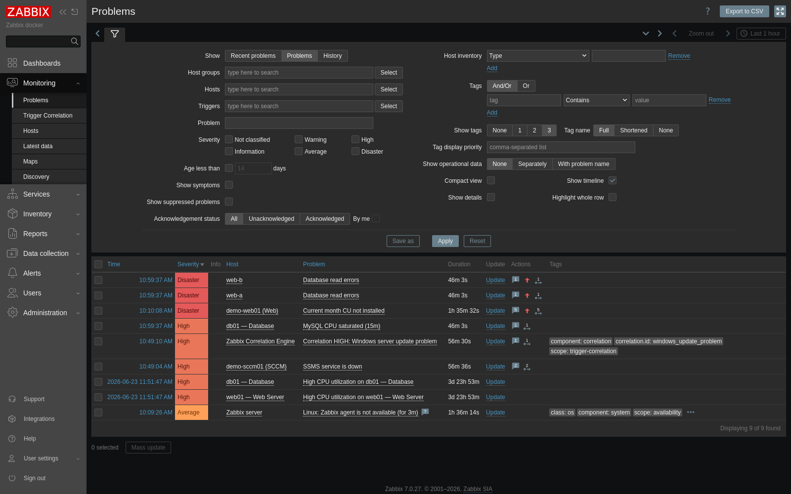

The two worked examples used throughout this guide are the same ones in
[`USE_CASES.md`](USE_CASES.md):

- **Example A (Correlation)** — *SSMS service is down* **+** *Current month CU not
  installed* → a new **`Correlation HIGH: Windows server update problem`**.
- **Example B (Severity escalation)** — while the *MySQL backend* is saturated,
  raise every *Database read errors* problem to **Disaster** across **all** web
  hosts, and restore it when the DB recovers.

---

## 1. Install & enable

Copy `TriggerCorrelation/` into the Zabbix frontend modules directory
(`/usr/share/zabbix/modules/`), set ownership/permissions (and SELinux context on
RHEL), then **Administration → General → Modules → Scan directory** and enable it:

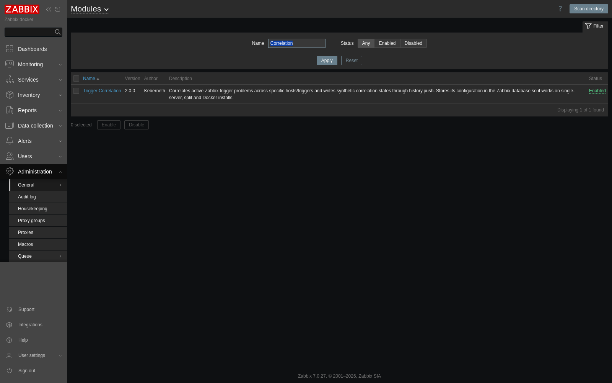

A new **Monitoring → Trigger Correlation** menu item appears (Super Admin only).

> On RHEL/SELinux installs, after copying the files run:
> ```bash
> sudo chown -R nginx:nginx /usr/share/zabbix/modules/TriggerCorrelation
> sudo semanage fcontext -a -t httpd_sys_content_t '/usr/share/zabbix/modules/TriggerCorrelation(/.*)?'
> sudo restorecon -Rv /usr/share/zabbix/modules/TriggerCorrelation
> sudo setsebool -P httpd_can_network_connect on   # lets php-fpm call the Zabbix API URL
> ```

---

## 2. Settings + self-check

Open **Monitoring → Trigger Correlation → Settings** and set the **API URL**
(`https://<your-zabbix>/api_jsonrpc.php` — mind the spelling, one `r` in
`jsonrpc`), an **API token**, and an **Evaluation shared secret**. Then click
**Run self-check** — every line should be green:

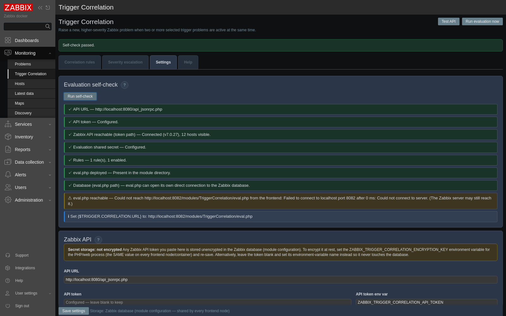

What the checks mean:

- **Zabbix API reachable (token path)** — the URL + token the evaluator uses over
  HTTP. (The separate **Test API** button uses the in-process frontend API, so it
  can pass even if this fails — fix the API URL until *both* are green.)
- **Database (eval.php path)** — `eval.php` can open its own DB connection (needs
  `pdo_mysql`/`pdo_pgsql` installed).
- **eval.php reachable** — the standalone evaluator endpoint is served and
  token-gated; the ℹ line gives you the exact `{$TRIGGER.CORRELATION.URL}` value.

---

## 3. The receiver host (`Zabbix Correlation Engine`)

The **Correlation** feature writes a synthetic severity to a trapper item and lets
a normal Zabbix trigger raise the problem. Import
`templates/trigger_correlation_receiver_zabbix_7.yaml`, create a host (the default
name **`Zabbix Correlation Engine`** works well), link the template, and set its
macros:

```text
{$TRIGGER.CORRELATION.URL}   = https://<your-zabbix>/modules/TriggerCorrelation/eval.php
{$TRIGGER.CORRELATION.TOKEN} = (the same Evaluation shared secret)
```

That host's HTTP-agent item calls `eval.php` once a minute, which drives **both**
features. After it runs, the discovered state item shows the current correlated
severity in **Monitoring → Latest data**:

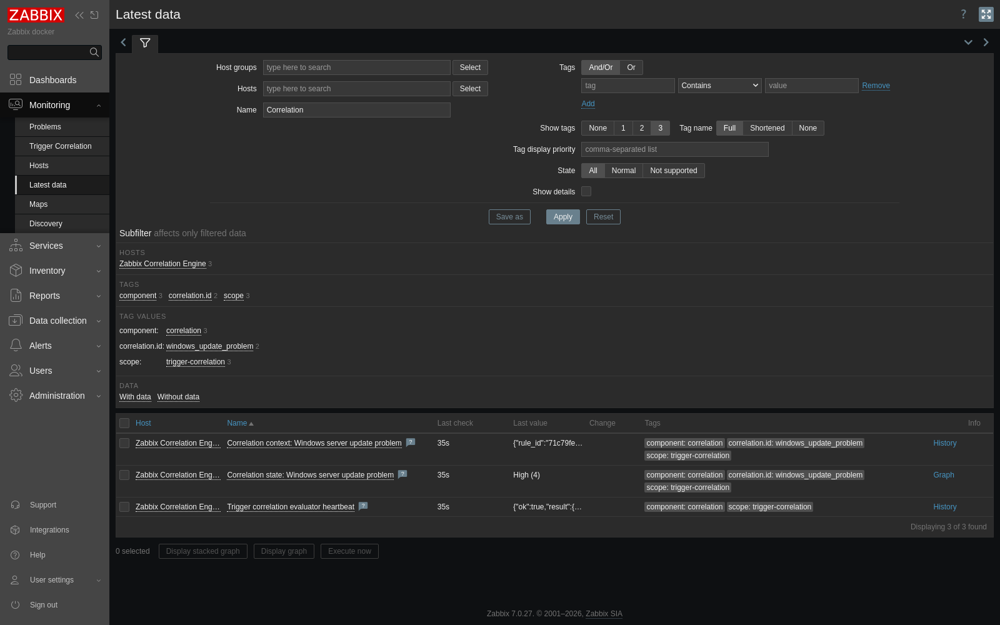

> **Severity escalation does not need this host or template at all** — it only
> needs the API URL + token (it edits existing problems in place). The receiver
> host is only for the Correlation feature.

---

## The example triggers

You don't create anything special for the source side — the module works with the
**normal Zabbix triggers you already have**. You just pick them as conditions
(correlation) or targets (severity escalation). Here are the example triggers used
throughout this guide, in **Data collection → Hosts → Triggers**:

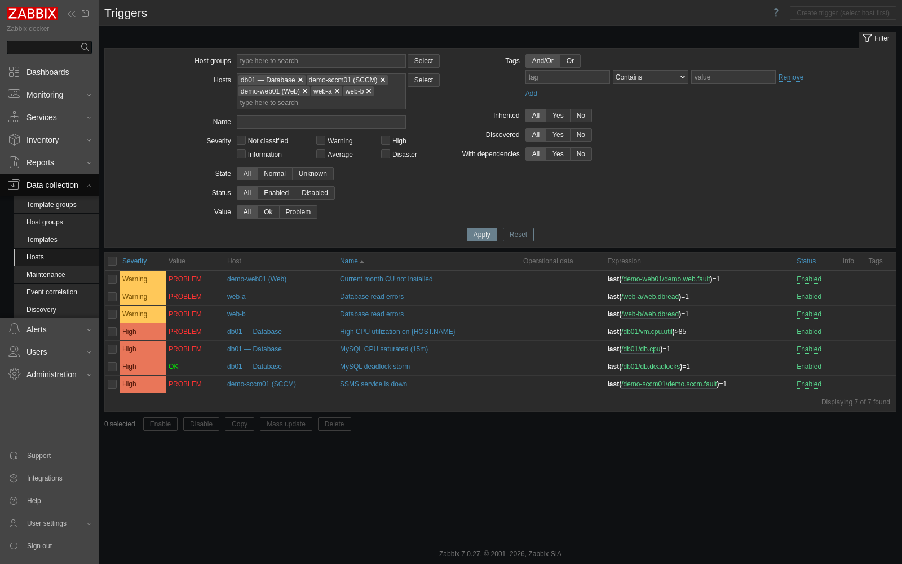

| Host | Trigger | Severity | Used as |
|---|---|---|---|
| demo-sccm01 | SSMS service is down | High | correlation + severity condition |
| demo-web01 | Current month CU not installed | Warning | correlation condition / escalation target |
| db01 | MySQL CPU saturated (15m) | High | severity condition |
| db01 | MySQL deadlock storm | High | severity condition (the "OR") |
| web-a, web-b | Database read errors | Warning | escalation **target** (same name on every host) |

> The expressions above are simple flag triggers (`last(/host/key)=1`) for the demo
> so they are easy to fire. In production they would be your real ones, e.g.
> `min(/db01/system.cpu.util,15m)>90` or `min(/web-a/app.db.read.errors,5m)>0` —
> the module doesn't care how the trigger is written, only whether it is in
> problem. Note that for the **All hosts / host group** escalation scope, the
> target trigger must have the **same name** on each host (here *Database read
> errors* on both `web-a` and `web-b`), because that scope matches by problem name.

---

## Example A — Correlation (Windows update incident)

### Build the rule

On the **Correlation rules** tab, add the source triggers (type a host, pick its
trigger from the dropdown — no IDs to look up), choose the output and severity:

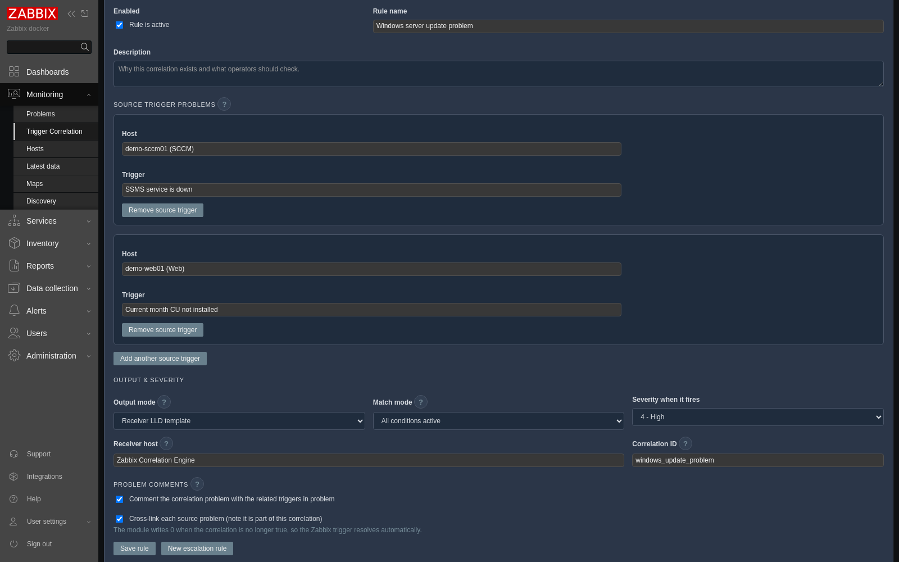

```text
Rule name:        Windows server update problem
Source triggers:  sccm01 → SSMS service is down
                  web01  → Current month CU not installed
Match mode:       All conditions active
Output mode:      Receiver LLD template
Receiver host:    Zabbix Correlation Engine
Correlation ID:   windows_update_problem
Severity:         4 - High
```

The saved rule shows its live **State** in the list (here **High**, because both
source triggers are currently in problem):

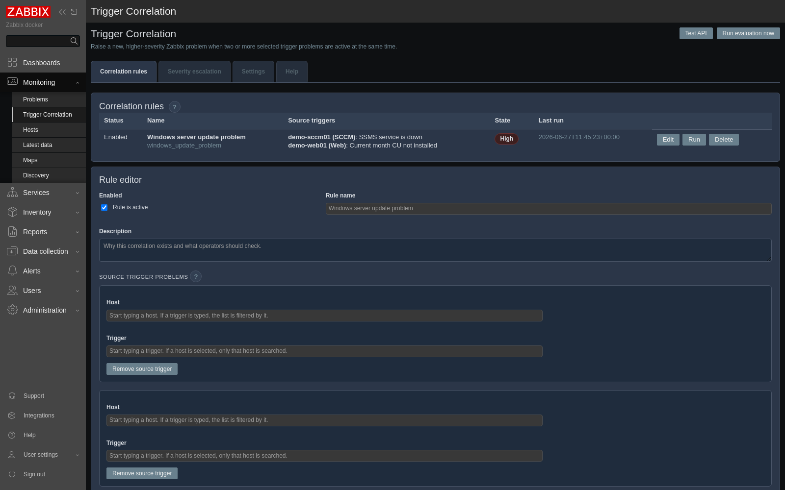

### How it looks when it fires

When both source problems are active, a new problem
**`Correlation HIGH: Windows server update problem`** is raised on the receiver
host. Its expression is just `last(.../trigger.correlation.state[windows_update_problem])=4`,
it carries a `correlation.id` tag, and the module posts a `[TC]` comment listing
the related triggers:

![Correlation problem detail with the [TC] comment](docs/images/07-correlation-problem.png)

When either source problem clears, the module writes `0` and the correlation
problem resolves automatically.

---

## Example B — Severity escalation (database backend degradation)

Here we **don't** want a new problem — we want to make the **existing** web/app
problems critical while the database backend is unhealthy, then put them back.

### Build the rule

On the **Severity escalation** tab, set the source condition (the DB symptom), the
target (the problem to raise) and the scope. This rule raises **every**
`Database read errors` problem — on **all hosts** — to Disaster while MySQL is
saturated:

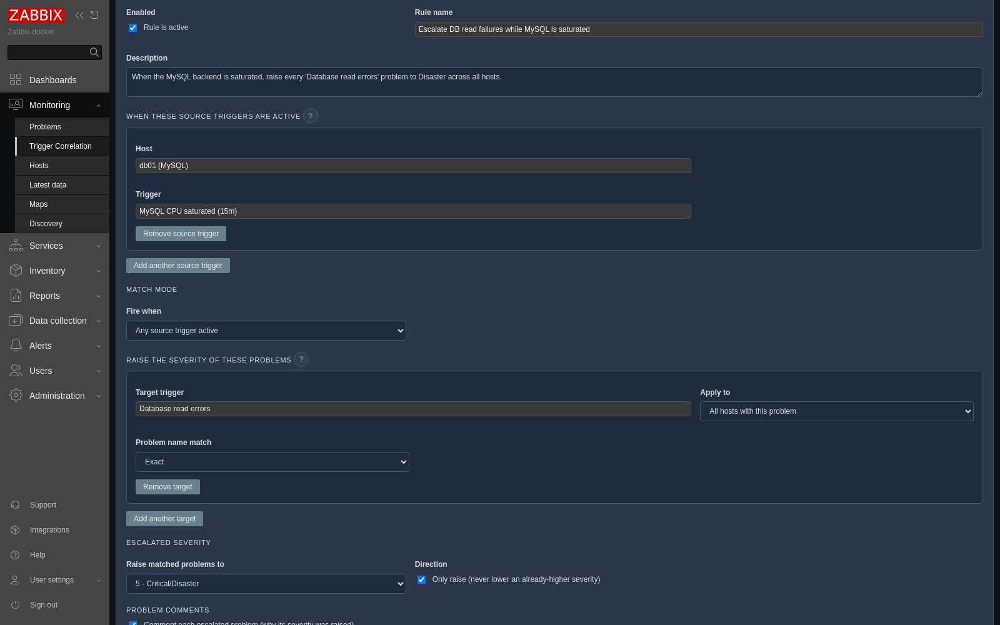

```text
Rule name:          Escalate DB read failures while MySQL is saturated
When (source):      db01 → MySQL CPU saturated (15m)
                    db01 → MySQL deadlock storm        (add a 2nd condition…)
Match mode:         Any source trigger active          (← "CPU OR deadlocks")
Raise the severity of:
  Target trigger:   Database read errors
  Apply to:         All hosts with this problem        (or: This host / A host group)
Escalated severity: 5 - Critical/Disaster
Only raise:         on
```

The saved rule shows **Escalating (N)** when it is actively holding problems up
(N = how many it has raised):

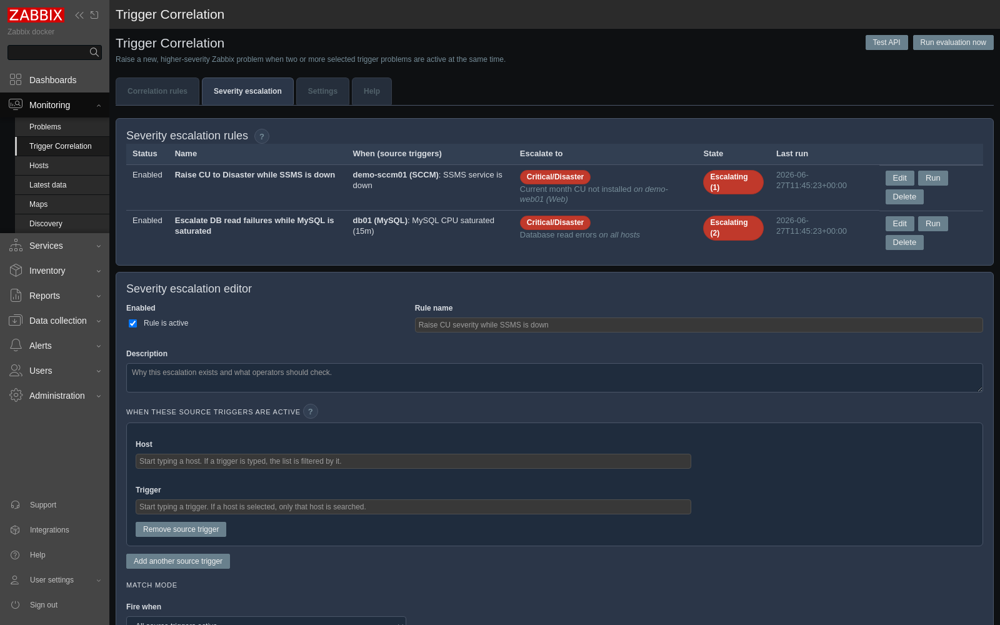

### How it looks when it fires

Each matched problem's severity is raised via a Zabbix problem update (it edits the
**event** severity, never the trigger's configured priority), with a
`[TC severity]` note recording the change. Here `Current month CU not installed`
has been lifted **Warning → Disaster**, and Zabbix records the `2 → 5` change in
the problem's update history:

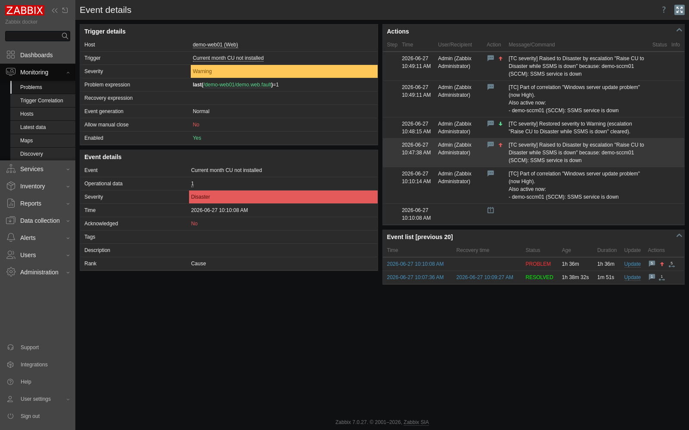

When the source condition clears (or you disable/delete the rule), every raised
problem drops back to its **original** severity automatically. Here is the full
cycle in real time — both `Database read errors` problems go **Warning →
Disaster** the moment MySQL saturates, and back to **Warning** when it recovers:

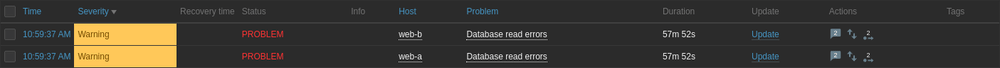

---

## Where to go next

- [`SETUP_RULES.md`](SETUP_RULES.md) — field-by-field rule walkthrough (both output modes).
- [`USE_CASES.md`](USE_CASES.md) — the two worked scenarios above in full, plus a modelling cheat-sheet (AND / OR / escalate-by-count / scopes).
- [`README.md`](README.md) — complete design, requirements, security and troubleshooting.

Every field in the editor also has a `?` help button, and the **Help** tab repeats
this guidance inside the module.
