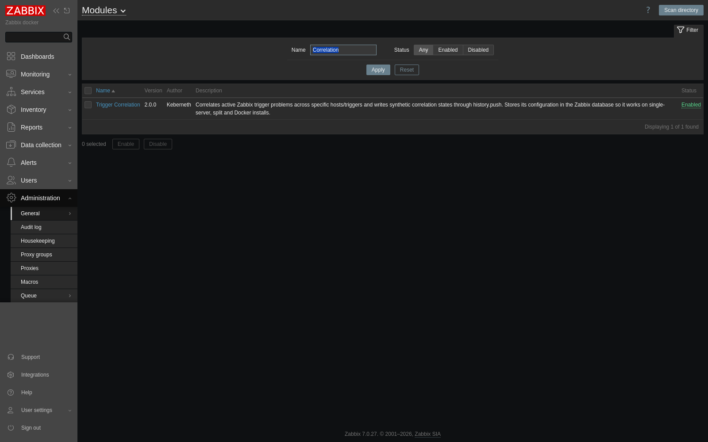
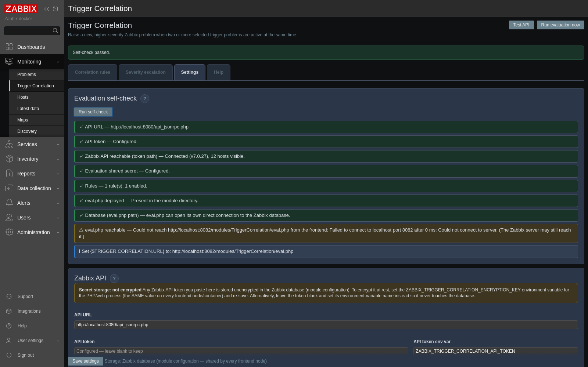
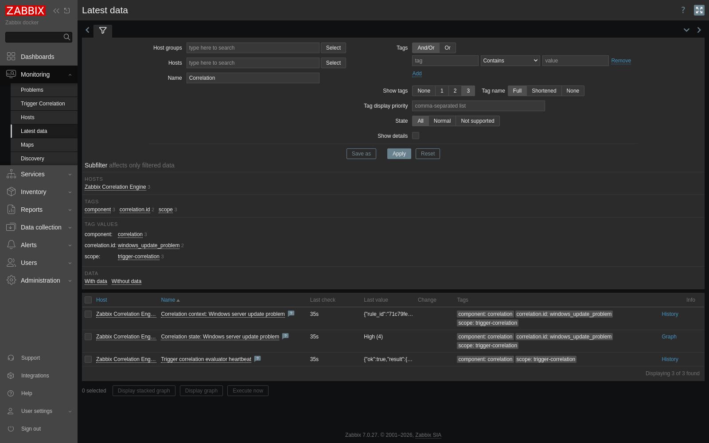
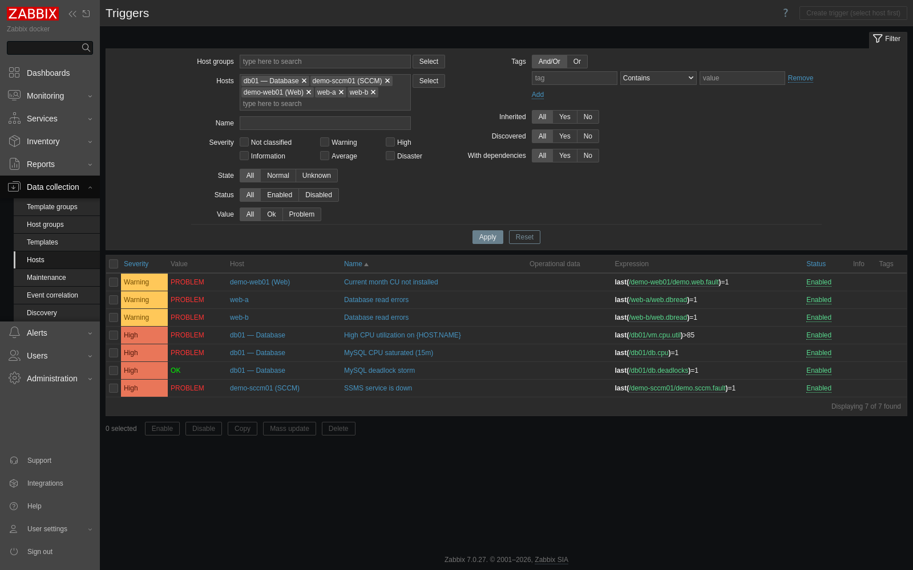
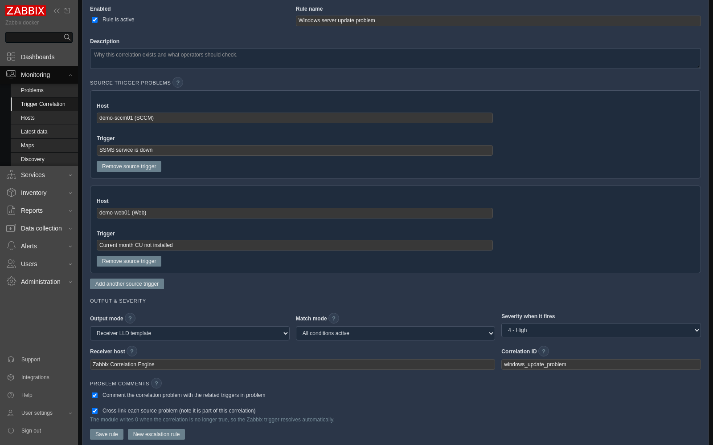
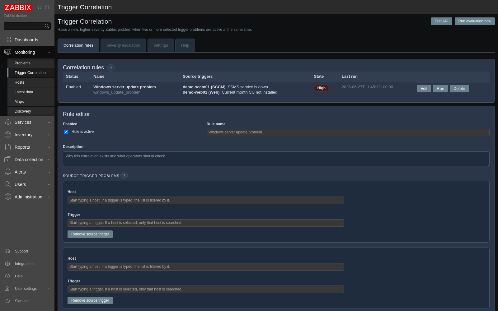
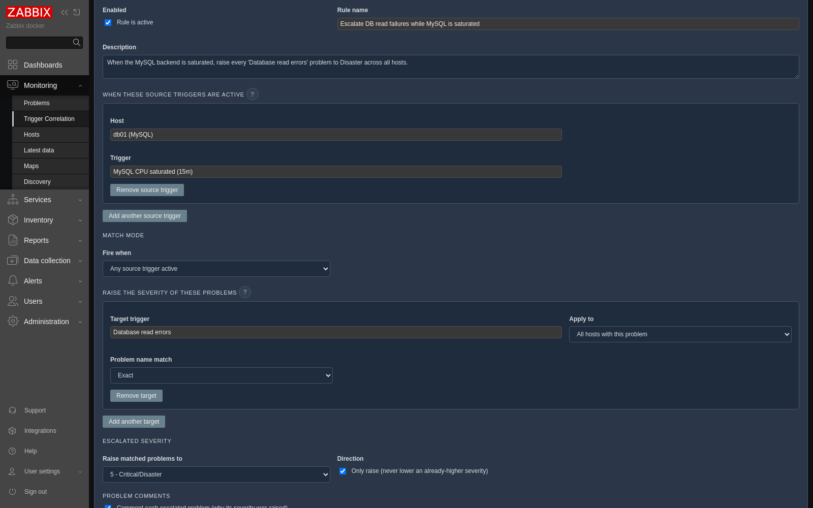
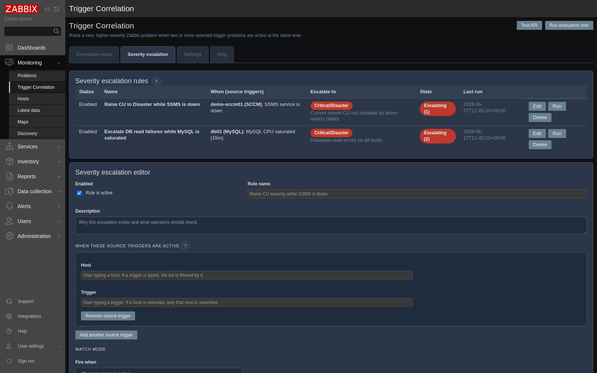
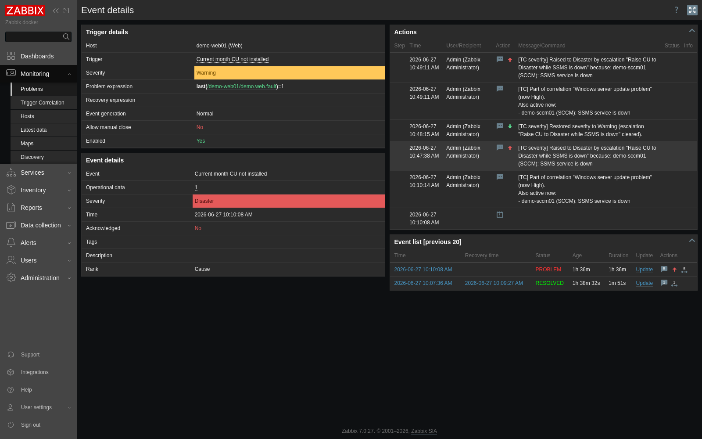

# Trigger Correlation — visual setup guide

A picture walkthrough of installing the **Trigger Correlation** Zabbix 7 module and
both of its features, end to end. All screenshots are from a real Zabbix 7.0
install running the module — substitute your own hosts and triggers.

The module has **two features**, each on its own tab:

| Feature | What it does |
|---|---|
| **Correlation** | Raises a **new** problem when a set of source triggers are active together. |
| **Severity escalation** | **Raises the severity of existing** problems while a source condition holds, then restores it. |

Here is what it looks like with **both** features firing at once — a new
`Correlation HIGH` incident, plus existing `Database read errors` and
`Current month CU not installed` problems lifted to **Disaster** (note the ↑
severity-change marker in the Update column):


The two worked examples used throughout this guide are the same ones in
[`USE_CASES.md`](USE_CASES.md):

- **Example A (Correlation)** — *SSMS service is down* **+** *Current month CU not
  installed* → a new **`Correlation HIGH: Windows server update problem`**.
- **Example B (Severity escalation)** — while the *MySQL backend* is saturated,
  raise every *Database read errors* problem to **Disaster** across **all** web
  hosts, and restore it when the DB recovers.

---

## 1. Install & enable

Copy `TriggerCorrelation/` into the Zabbix frontend modules directory
(`/usr/share/zabbix/modules/`), set ownership/permissions (and SELinux context on
RHEL), then **Administration → General → Modules → Scan directory** and enable it:



A new **Monitoring → Trigger Correlation** menu item appears (Super Admin only).

> On RHEL/SELinux installs, after copying the files run:
> ```bash
> sudo chown -R nginx:nginx /usr/share/zabbix/modules/TriggerCorrelation
> sudo semanage fcontext -a -t httpd_sys_content_t '/usr/share/zabbix/modules/TriggerCorrelation(/.*)?'
> sudo restorecon -Rv /usr/share/zabbix/modules/TriggerCorrelation
> sudo setsebool -P httpd_can_network_connect on   # lets php-fpm call the Zabbix API URL
> ```

---

## 2. Settings: API URL + token — that is all

Open **Monitoring → Trigger Correlation → Settings** and set the **API URL** (click
**Detect** — it finds the address this web server reaches its own
`api_jsonrpc.php` at; or type `https://<your-zabbix>/api_jsonrpc.php`) and an
**API token**. Save.

You do not set an evaluation secret, import a template, create a host or set
macros. The first time you save a rule the module does all of that itself (see
the next section), and the self-check verifies it.



**Run self-check** at any time. Besides the API URL/token, the database path of
`eval.php` and the web server routing, it reports from the **Zabbix server's**
point of view whether the engine host's heartbeat reaches `eval.php`, whether the
API token's user can see the correlation hosts, which user groups can see the
correlation host group, and any unused correlation hosts. If something is red,
**Repair automatic setup** fixes most of it:

- a heartbeat refused with "Invalid evaluation token" gets a new secret (written to
  the engine host and stored as a hash in one transaction);
- a heartbeat that cannot reach `eval.php` gets the first URL the Zabbix server
  itself can fetch (it tests candidates such as the API URL's host, the Frontend
  URL and the web container's own names);
- deleted correlation hosts are recreated, and states/severities left behind by
  rules that no longer exist are cleared.

---

## 3. What the module sets up for you

| Object | What it is |
|---|---|
| `Template Trigger Correlation Receiver` | engine template: heartbeat HTTP-agent item (calls `eval.php` every minute) + receiver LLD |
| `Template Trigger Correlation Auto Receiver` | receiver LLD only, for correlation hosts |
| **Engine host** `Zabbix Correlation Engine` | runs the heartbeat. Any host that already has the heartbeat item is used instead, so an existing hand-made setup keeps working. Its `{$TRIGGER.CORRELATION.URL}` is a server-verified address and `{$TRIGGER.CORRELATION.TOKEN}` the module-generated secret |
| **Correlation hosts** `Correlation: <host> + <host>` | one per set of source hosts, shared by every rule over the same hosts; in the engine host's host group unless you pick another one in Settings → Automatic setup |

After the next heartbeat the discovered state item shows the current correlated
severity in **Monitoring → Latest data**:



> Running the evaluation from cron/curl instead? Set Settings → Automatic setup →
> **Evaluation driver** to "I call eval.php myself": the module then never creates
> an engine host or touches the secret. (It also notices a recent non-Zabbix caller
> of `eval.php` by itself and does not add a second driver next to it.)

> **Docker:** the Zabbix server reaches the web container by its service name
> (e.g. `http://zabbix-web:8080/modules/TriggerCorrelation/eval.php`), not by the
> address your browser uses. The server-side test finds such an address
> automatically when it can; otherwise set Settings → Automatic setup →
> **Evaluation URL**.

---

## The example triggers

You don't create anything special for the source side — the module works with the
**normal Zabbix triggers you already have**. You just pick them as conditions
(correlation) or targets (severity escalation). Here are the example triggers used
throughout this guide, in **Data collection → Hosts → Triggers**:



| Host | Trigger | Severity | Used as |
|---|---|---|---|
| demo-sccm01 | SSMS service is down | High | correlation + severity condition |
| demo-web01 | Current month CU not installed | Warning | correlation condition / escalation target |
| db01 | MySQL CPU saturated (15m) | High | severity condition |
| db01 | MySQL deadlock storm | High | severity condition (the "OR") |
| web-a, web-b | Database read errors | Warning | escalation **target** (same name on every host) |

> The expressions above are simple flag triggers (`last(/host/key)=1`) for the demo
> so they are easy to fire. In production they would be your real ones, e.g.
> `min(/db01/system.cpu.util,15m)>90` or `min(/web-a/app.db.read.errors,5m)>0` —
> the module doesn't care how the trigger is written, only whether it is in
> problem. Note that for the **All hosts / host group** escalation scope, the
> target trigger must have the **same name** on each host (here *Database read
> errors* on both `web-a` and `web-b`), because that scope matches by problem name.

---

## Example A — Correlation (Windows update incident)

### Build the rule

On the **Correlation rules** tab, add the source triggers (type a host, pick its
trigger from the dropdown — no IDs to look up), choose the output and severity:



```text
Rule name:        Windows server update problem
Source triggers:  sccm01 → SSMS service is down
                  web01  → Current month CU not installed
Match mode:       All conditions active
Output mode:      Automatic correlation host (recommended)
Correlation ID:   windows_update_problem      (optional — defaults to the rule name)
Severity:         4 - High
```

On save the module answers *Created the correlation host “Correlation: sccm01 +
web01”*. A second rule over the same two hosts reuses that host.

The saved rule shows its live **State** in the list (here **High**, because both
source triggers are currently in problem):



### How it looks when it fires

When both source problems are active, a new problem
**`Correlation HIGH: Windows server update problem`** is raised on the
correlation host `Correlation: sccm01 + web01`. Its expression is just `last(.../trigger.correlation.state[windows_update_problem])=4`,
it carries a `correlation.id` tag, and the module posts a `[TC]` comment listing
the related triggers:

![Correlation problem detail with the [TC] comment](docs/images/07-correlation-problem.png)

When either source problem clears, the module writes `0` and the correlation
problem resolves automatically.

---

## Example B — Severity escalation (database backend degradation)

Here we **don't** want a new problem — we want to make the **existing** web/app
problems critical while the database backend is unhealthy, then put them back.

### Build the rule

On the **Severity escalation** tab, set the source condition (the DB symptom), the
target (the problem to raise) and the scope. This rule raises **every**
`Database read errors` problem — on **all hosts** — to Disaster while MySQL is
saturated:



```text
Rule name:          Escalate DB read failures while MySQL is saturated
When (source):      db01 → MySQL CPU saturated (15m)
                    db01 → MySQL deadlock storm        (add a 2nd condition…)
Match mode:         Any source trigger active          (← "CPU OR deadlocks")
Raise the severity of:
  Target trigger:   Database read errors
  Apply to:         All hosts with this problem        (or: This host / A host group)
Escalated severity: 5 - Critical/Disaster
Only raise:         on
```

The saved rule shows **Escalating (N)** when it is actively holding problems up
(N = how many it has raised):



### How it looks when it fires

Each matched problem's severity is raised via a Zabbix problem update (it edits the
**event** severity, never the trigger's configured priority), with a
`[TC severity]` note recording the change. Here `Current month CU not installed`
has been lifted **Warning → Disaster**, and Zabbix records the `2 → 5` change in
the problem's update history:



When the source condition clears (or you disable/delete the rule), every raised
problem drops back to its **original** severity automatically. Here is the full
cycle in real time — both `Database read errors` problems go **Warning →
Disaster** the moment MySQL saturates, and back to **Warning** when it recovers:


---

## Example C — Cluster: one node down is High, both down is Disaster

A node going down in a two-node cluster is serious (no redundancy left) but the
service still runs; both nodes down is an outage. One correlation rule covers both:

1. In the rule editor, under **Add the same trigger from every host in a group**,
   pick the cluster's host group and type the node-down trigger name (e.g.
   *Cluster node is down*, or *is unreachable (ICMP ping)*) → **Add from group**.
   One source trigger per node is added.
2. Click **Cluster preset**: match mode *Escalate by active count* with tiers
   **≥1 → High** and **≥ number of nodes → Disaster**.
3. Output: *Automatic correlation host*. Save.

```text
Rule name:     Demo cluster availability
Source:        demo-cluster-node01 → Cluster node is down
               demo-cluster-node02 → Cluster node is down
Match mode:    Escalate by active count   ≥1 → High, ≥2 → Disaster
Output:        Automatic correlation host → "Correlation: demo-cluster-node01 + demo-cluster-node02"
```

One node down raises `Correlation HIGH: Demo cluster availability`; when the second
goes down it becomes `Correlation CRITICAL: …` (the High one resolves), and it steps
back down — or clears — as nodes return.

---

## The Dashboard

The module opens on a live **Dashboard** (refreshes every 30 s):

- **Summary** — correlations firing by severity, problems currently raised by
  escalation, source problems involved, and whether evaluation is running.
- **By correlation** — one card per rule, worst first: the severity it has *right
  now*, its source triggers grouped per host (each with its problem severity and
  age), the correlation problem it raised, and its correlation host. Severity
  escalations follow, each with the problems it is holding up
  (*Warning → Disaster*) and why.
- **By host** — each host that takes part in a rule, its watched triggers, and
  chips for every correlation/escalation it feeds, coloured by the criticality it
  is causing.

---

## Where to go next

- [`SETUP_RULES.md`](SETUP_RULES.md) — field-by-field rule walkthrough (both output modes).
- [`USE_CASES.md`](USE_CASES.md) — the two worked scenarios above in full, plus a modelling cheat-sheet (AND / OR / escalate-by-count / scopes).
- [`README.md`](README.md) — complete design, requirements, security and troubleshooting.

Every field in the editor also has a `?` help button, and the **Help** tab repeats
this guidance inside the module.
