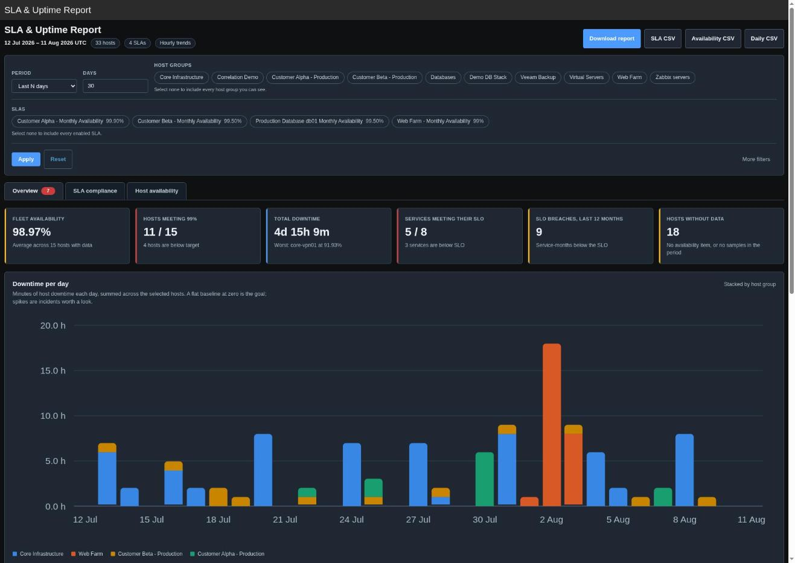
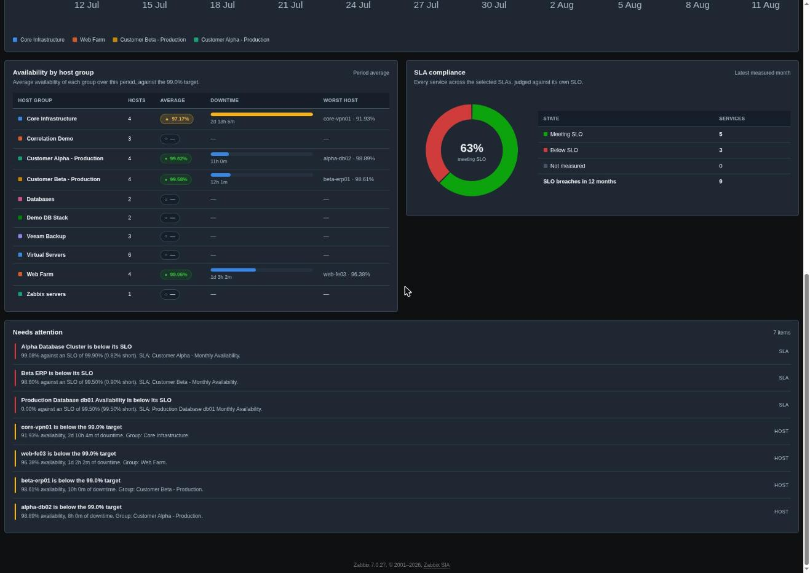
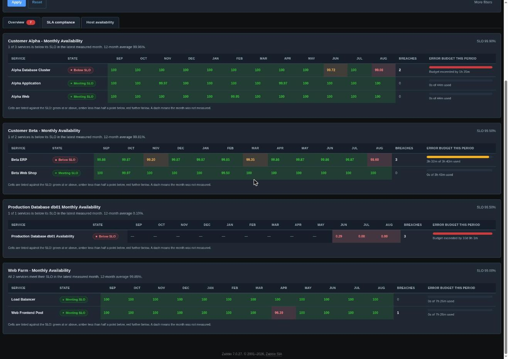
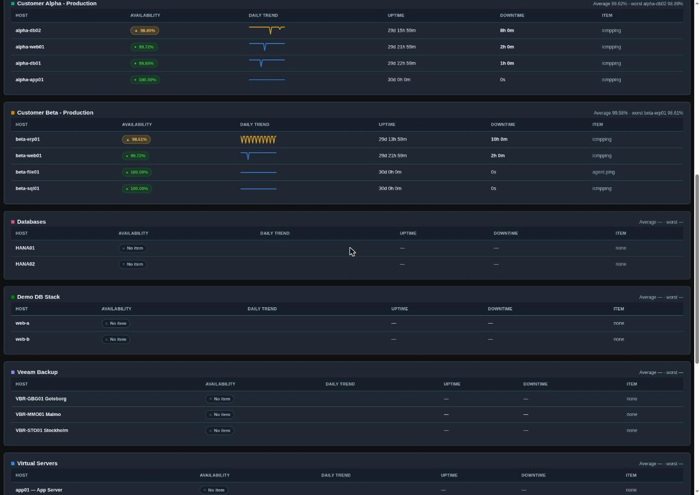
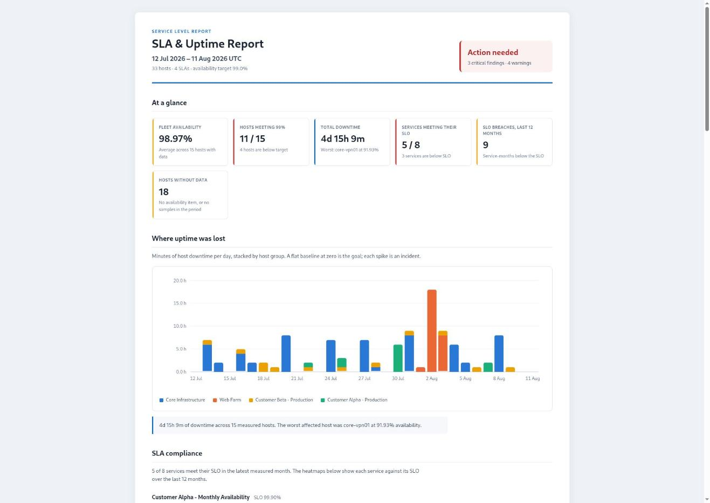
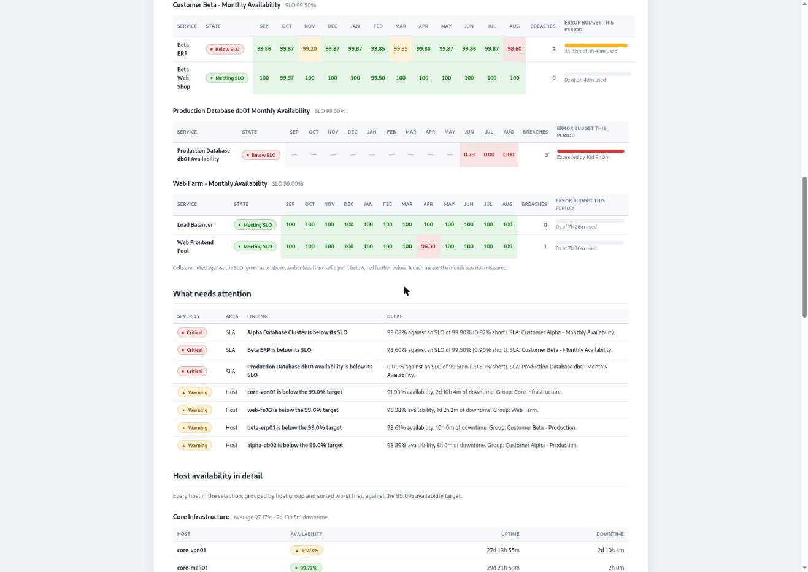

# SLA & Uptime Report

A Zabbix 7.0 frontend module that turns Zabbix's SLA engine and host availability items into a
report you can put in front of both an operations team and a customer.

It answers three questions on one page:

1. **Are we meeting our commitments?** — every service across every SLA, judged against its own
   SLO, with a rolling 12-month heatmap and this period's error budget.
2. **How available were the hosts?** — per-group uptime with daily trend sparklines, measured
   from each host's availability item.
3. **Where was uptime lost?** — downtime minutes per day, stacked by host group, so each
   incident is visible as a spike.

Menu location: **Reports → SLA & Uptime Report**.

---

## The three tabs

All three are rendered from a single data build, so no tab can show a different version of the
truth.

### Overview

Headline figures, the daily downtime chart, availability by host group, SLA compliance at a
glance, and a prioritised "needs attention" list — services below SLO first, then hosts below
the availability target, worst first.

### SLA compliance

One card per SLA. Each service gets a 12-month SLI heatmap tinted against the SLO — green at or
above, amber less than half a point below, red further below — with the value printed in every
cell, a breach count, and an **error budget** for the current period: how much of the allowed
downtime has been consumed, and by how much it was exceeded when it was.

### Host availability

Every host, grouped by host group and sorted **worst first**, with an availability pill, a
daily-trend sparkline (incidents are visible as dips), uptime, downtime, and which item the
measurement came from. Hosts without a usable item say so instead of disappearing.

---

## Error budgets

An SLO is easier to manage as a budget than as a percentage. For each service the module
converts the SLO into allowed downtime for the current period and shows how much is spent:

- **SLO 99.9% on a 31-day month** → 44 minutes of allowed downtime.
- A service at 99.08% mid-month shows *"Budget exceeded by 1h 35m"* in red.
- A healthy service shows *"0s of 44m used"*.

The bar turns amber at 80% consumed and red at 100%, and a service that is still meeting its
SLO but has eaten most of its budget appears in the attention list before it breaches.

---

## How availability is measured

Each host is measured from one item, the first of these keys that exists:
`agent.ping` → `icmpping` → `zabbix[host,agent,available]`.

The calculation source follows the window length:

- **≤ 7 days → raw history.** Availability = OK samples / expected samples, where the expected
  count includes inferred missing samples — a polling gap counts as downtime rather than
  hiding. The polling interval comes from the item's delay, falling back to the median
  observed interval.
- **> 7 days → hourly trends.** Each trend hour counts as up or down as a whole (Zabbix stores
  integer averages for unsigned items), summed over covered hours; hours with no trend data
  are excluded from the denominator rather than silently counted as downtime, and a host with
  no coverage reports *No data* instead of a made-up number.

The page always says which source it used, and what that means for precision.

### SLI numbers

SLI values come from the Zabbix SLA engine (`sla.getSli`) — the same numbers the native SLA
report shows — so this module never disagrees with Zabbix about compliance. One subtlety the
module handles: the SLI matrix columns follow the API **response's** service order, not the
request's, and mapping them naively attributes one service's SLI to another.

---

## Filters

| Filter | Notes |
|---|---|
| **Period** | Last N days, previous month, a specific month, or a custom range. All UTC. |
| **Host groups** | Selectable pills; a search box filters the list when it is long. None = all. |
| **SLAs** | Pills showing each SLA's SLO. None = all enabled SLAs. |
| **Availability target** | Default 99.0%. Hosts below it are flagged; below 90% is critical. |
| **Rows per group** | Table cap per host group. Health counts are never truncated. |
| **Exclude disabled hosts** | On by default. |

**Reset** returns everything to defaults. Tabs, filter and downloads all carry the full filter
state, and the whole page works with JavaScript disabled.

---

## Exports

**Download report** produces a single self-contained HTML file — inline CSS, inline SVG, no
external requests — with a cover verdict, the headline figures, the downtime chart, every SLA
heatmap with error budgets, the attention list and the full host tables. It prints to A4
landscape (use the browser's *Print → Save as PDF* for a PDF).

CSV exports: the SLA heatmap (one row per service-month), host availability, and daily
downtime per group. All CSV cells are neutralised against spreadsheet formula injection.

---

## Requirements

- Zabbix **7.0** frontend (single-server, multi-server/HA or Docker).
- Any user with at least the *Zabbix user* role can open the report; data is scoped by the
  user's host group and service permissions.
- **For the SLA side:** enabled SLAs under *Services → SLA* with services linked by service
  tags.
- **For the availability side:** an `agent.ping`, `icmpping` or `zabbix[host,agent,available]`
  item on each host you want measured.

---

## Install / enable

1. Copy this directory to `ui/modules/sla_uptime_report` in the Zabbix frontend (for Docker,
   mount it into the web container at the same path).
2. **Administration → General → Modules → Scan directory**.
3. Enable **SLA & Uptime Report**.
4. Open **Reports → SLA & Uptime Report**.

---

## Accuracy notes

Places where the obvious implementation would have been wrong, and what the module does
instead:

- **`sla.getSli` reorders services** in its response; the module maps SLI columns by the
  response's service ids, not the request order.
- **A missed poll is downtime**, not missing data, on the history path — and the reverse on
  the trends path, where an uncovered hour is excluded from the denominator instead of being
  counted as downtime, because trend gaps usually mean retention, not outage.
- **"No item" and "no data" are answers**, shown as such — never silently dropped, and never
  averaged into the fleet number.
- **Health counts, the attention list and the export cover every matching host**; the
  per-group row limit truncates tables only.
- **Chart colours follow the host group**, with collisions among the groups on screen resolved
  to free slots so two adjacent series never share a colour.
- **One unit per axis** — the downtime axis picks minutes, hours or days from its maximum and
  every tick uses it.

---

## Performance & limits

The report is built from a bounded number of batched API calls; there are no per-host queries.

| Guard | Value |
|---|---|
| Hosts measured | 2 000 |
| SLAs | 200 |
| History rows per report | 400 000 (keyset-paginated in 2 000-row pages) |
| Trend rows per API call | ~200 000 (chunk size adapts to the window length) |
| Report window | 768 days |
| Page time limit | 300 s |

When a cap actually truncates something, the page says so rather than quietly showing a
partial answer.

Measured on a 33-host, 4-SLA environment: ~60 ms for a 30-day report, ~240 ms for a full year.
