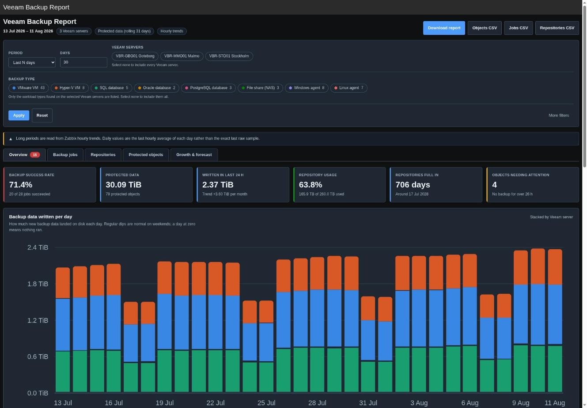
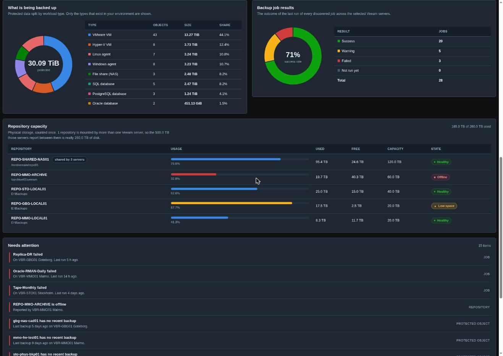
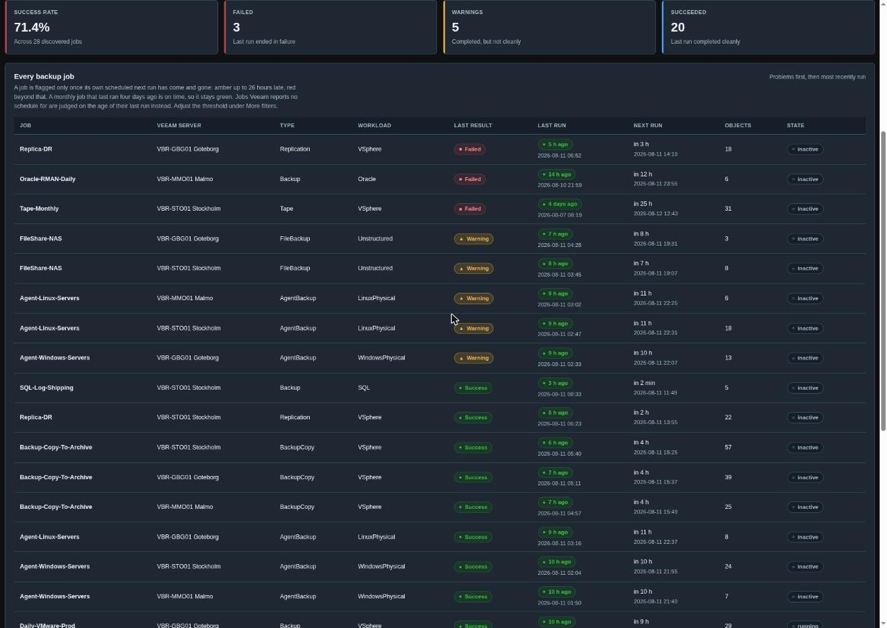
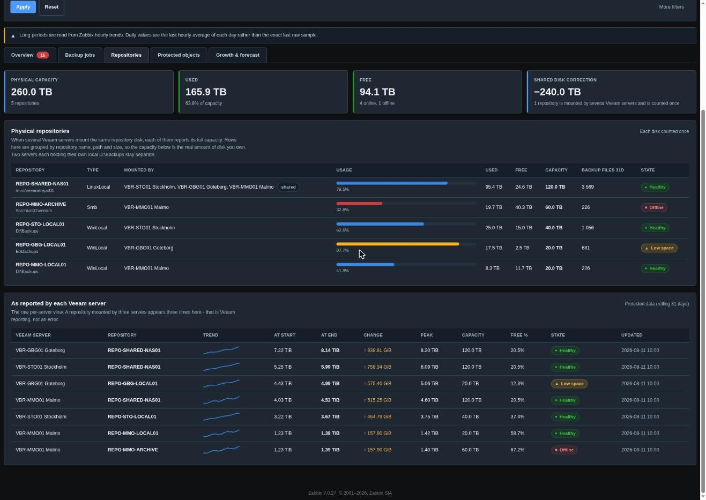
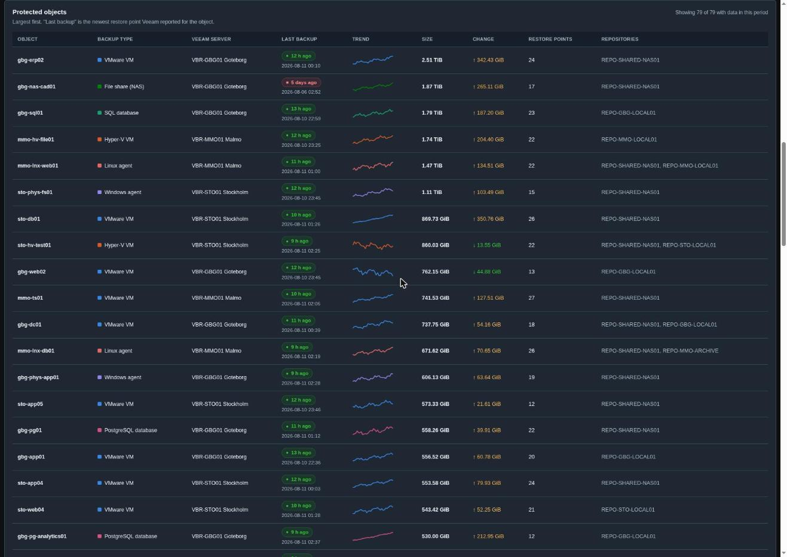
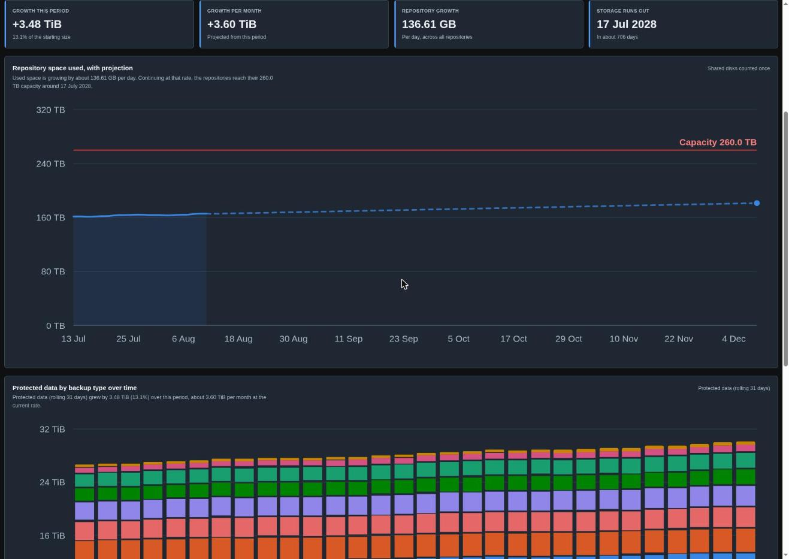
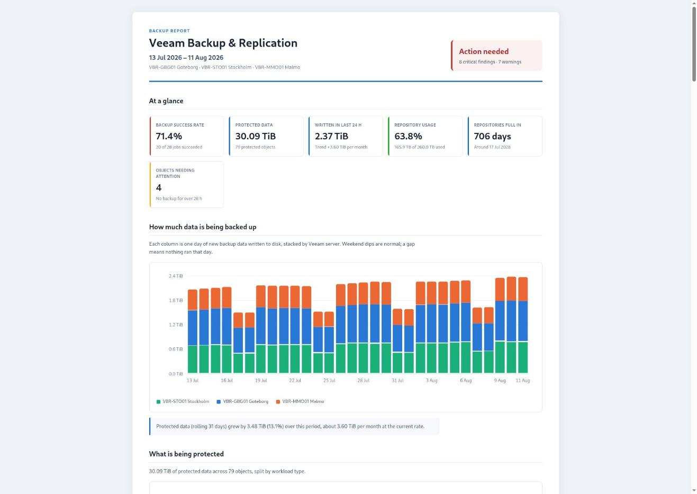
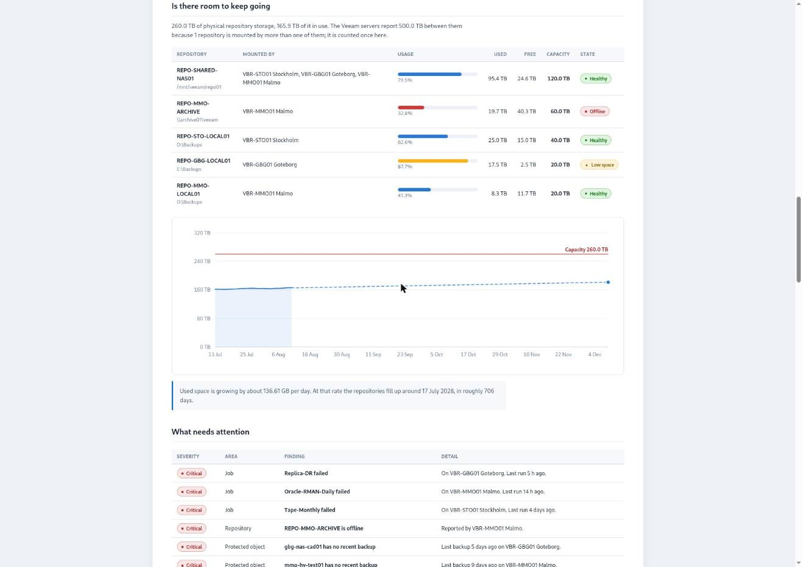

# Veeam Backup Report

A Zabbix 7.0 frontend module that turns the data collected by the **Veeam Backup and
Replication by HTTP v13** template into a report you can put in front of both a backup
administrator and a customer.

It answers four questions on one page:

1. **Did the backups run?** — every discovered job, its last result, when it ran, when it runs next.
2. **What is protected, and how much?** — totals broken down by workload type (VMware VM, SQL database, file share, …).
3. **Is there room to keep going?** — repository capacity, with the shared-disk double count removed.
4. **Where is this heading?** — growth per month and a projected date the repositories fill up.

Menu location: **Reports → Veeam Backup Report**.



---

## The five tabs

All five are rendered from a single data build, so switching is instant and no tab can show a
different version of the truth.

| Tab | What it is for |
|---|---|
| **Overview** | The one screen to look at daily. |
| **Backup jobs** | Every job across every selected Veeam server. |
| **Repositories** | Physical storage (each disk counted once) and the raw per-server view. |
| **Protected objects** | Every VM, database, agent and file share. |
| **Growth & forecast** | Where the storage is heading. |

### Overview

Headline figures, backup volume per day stacked by server, what is being backed up, job
results, repository capacity, and a prioritised "needs attention" list.



### Backup jobs

Failures first, then warnings, then the most recently run.



A job is flagged **only once its own scheduled next run has come and gone** — amber up to the
overdue threshold, red beyond it. A monthly tape job that last ran four days ago is on time, so
its "last run" stays green even while its *result* shows red for having failed. Jobs Veeam
reports no schedule for fall back to the age of their last run.

### Repositories



### Protected objects

Largest first, with a trend sparkline coloured by workload type and the age of the newest
restore point.



### Growth & forecast

Used space against capacity with a straight-line projection, protected data by workload type
over time, the fastest-growing objects, and a per-server summary.



---

## The shared repository disk

This is the part most backup reports get wrong.

When several Veeam servers mount the **same** repository disk, each of them registers its own
repository object and each reports that disk's **full** capacity. Adding the per-server totals
therefore multiplies the array by the number of servers. Three servers on one 120 TB disk look
like 360 TB of storage you do not own.

The module groups repositories by **repository name + normalised path**, then counts each
physical disk once:

- **Capacity / used / free** are taken once per physical disk.
- **Backup data written** really is per server, so that *is* summed.
- The correction is shown explicitly: `−240.0 TB`, "1 repository is mounted by several Veeam servers and is counted once".

Two servers that each have their own local `D:\Backups` are **not** merged — the repository
names differ. As a second guard, members of one name+path group whose capacity differs by more
than 2% are split apart, and that comparison runs over the group sorted by capacity so the
result never depends on the order Veeam happened to return the rows in.
`tests/RepositoryGroupingTest.php` runs each case through every permutation of its input.

If your repositories are named differently on each server they will not be grouped; renaming
them consistently in the Veeam console is the fix.

---

## Backup type breakdown

Totals are broken down by workload type — VMware VM, Hyper-V VM, SQL / Oracle / PostgreSQL
database, Windows and Linux agent, file share, and so on.

**The type list is built from your data, never from a fixed menu.** If nothing in the
environment is a PostgreSQL backup, PostgreSQL is not offered as a filter option. Deselect a
Veeam server and any type that only existed there disappears from the filter.

Two details that matter in practice:

- Type options are computed *before* the type filter is applied, so selecting one type does not
  erase the others from the filter.
- Each type keeps a fixed colour, and each Veeam server keeps a colour derived from its position
  in the full host list. Filtering never repaints the surviving series.

An unrecognised platform is passed through under its own name rather than swept into "Other",
so a workload the classifier has never seen still shows up in the report and in the filter.

---

## Filters

| Filter | Notes |
|---|---|
| **Period** | Last N days, previous month, a specific month, or a custom range. |
| **Veeam servers** | Select none to include them all. |
| **Backup type** | Dynamic — only the types present on the selected servers. |
| **Size metric** | Protected data (rolling 31 days) or data written (last 24 hours). |
| **Data source** | Automatic (trends beyond 7 days), raw history, or hourly trends. |
| **Overdue after** | Hours before a backup counts as overdue; twice that is critical. Default 26 h. |
| **Table rows** | Row cap for the detail tables. |
| **Find object / repository** | Free-text search. |

**Reset** returns everything to defaults. The advanced filters live behind **More filters** and
open automatically when any of them is set.

The row limit truncates *tables only*. Health counts, the "needs attention" list, the export's
overdue table and the fastest-growing ranking are all computed over every matching object, so an
overdue object at position 101 is still surfaced.

---

## Exports

The **Download report** button produces a single self-contained HTML file: inline CSS, inline
SVG, no external requests. It opens on any machine, emails cleanly, and prints to A4 (use the
browser's *Print → Save as PDF* for a PDF).

It is written for two audiences at once — a cover verdict, headline figures and a
plain-language sentence under every chart for management, with the full tables below for
whoever has to act on it.





CSV exports: objects, jobs, repositories, Veeam servers, daily totals and the type breakdown.
All CSV cells are neutralised against spreadsheet formula injection.

---

## Charts

Charts are generated as SVG in PHP — no JavaScript library, no external requests, identical
markup in the page and in the export.

- The eight-slot categorical palette is validated for colour-blind separation in both light and
  dark themes (adjacent-pair ΔE 9.1 light / 8.4 dark in OKLab×100, against an ≥8 target).
- Every chart carries a legend and a table twin, so no value is reachable only by colour or
  only by hovering.
- Axis ticks round in the unit they are printed in and every tick on an axis shares that unit.
- Status colours (good / warning / critical) are reserved, never reused as a series colour, and
  always paired with a glyph and a word.

The page works with JavaScript disabled: the tab buttons are real submit buttons bound to the
filter form, the filter is an ordinary GET form, and charts carry native `<title>` tooltips.

---

## Requirements

- Zabbix 7.0 frontend (single-server, multi-server/HA or Docker).
- The **Veeam Backup and Replication by HTTP v13** template applied to each Veeam server, with
  data collected. The template ships in `template/`.
- Any user role of *Zabbix User* or above can view the report.

### Template

`template/Veeam Backup and Replication by HTTP v13.yaml` is the template this module reads.
It adds classification tags used by the report:

| Discovery | Added tags |
|---|---|
| Protected objects | `type` |
| Repositories | `type`, `path` |
| Jobs | `type`, `workload` |

These are **additive only** — no item key changes — so importing the updated template over an
existing one is safe and does not break history. The `path` tag is what lets the module detect
a shared repository disk; the `type` tag is what powers the backup-type breakdown. The module
falls back to parsing the item name when the tags are absent, so it still works against an
older import, just less precisely.

---

## Installation

1. Copy this directory into the frontend's `modules/` directory (or bind-mount it there).
2. **Administration → General → Modules → Scan directory**, then enable *Veeam Backup Report*.
3. Import `template/Veeam Backup and Replication by HTTP v13.yaml` and apply it to each Veeam
   server, filling in `{$VEEAM.API.URL}`, `{$VEEAM.USER}` and `{$VEEAM.PASSWORD}`.
4. Open **Reports → Veeam Backup Report**.

If the page says no Veeam hosts were found, the template has not produced
`veeam.backup.total.size.24h` data yet — wait for one collection interval.

---

## Accuracy notes

A few places where the obvious implementation would have been wrong, and what the module does
instead:

- **A server that stops reporting** does not silently subtract its share. Headline totals are
  each server's last known value inside the period, summed — not the last daily row, which only
  covers the servers that happened to have a sample that day. A stale server is named in a
  warning instead.
- **The growth projection** regresses against real elapsed days, not array indices, so gaps in
  history cannot understate the growth rate. It also waits until every repository has reported
  before starting the series, so a disk appearing mid-window is not read as sudden growth.
- **"More than two years" and "cannot be projected"** are different answers and are shown
  differently.
- **A free-space reading of 0%** is treated as unknown when Veeam reports no capacity at all —
  the template returns 0 as a sentinel there, and taking it literally paints healthy object
  storage red.

---

## Performance

The report is built from a bounded number of batched API calls; there is no per-host or
per-object query loop.

| Guard | Value |
|---|---|
| Objects whose daily series is fetched | 600 (largest first) |
| Repositories in the storage growth series | 200 |
| Item-ids per history/trend call | 100 |
| Rows per API call | 2 000 000 |
| Rows held in memory across one fetch | 600 000 |
| History window before falling back to trends | 31 days (7 days in Automatic mode) |
| Page time limit | 300 s |

Whenever a cap actually truncates something, the page says so rather than quietly showing a
partial answer.

Measured on a 3-server, 79-object environment: 83 ms for a 7-day report, 383 ms for a full year.

---

## Tests

```
php tests/RepositoryGroupingTest.php
```

Covers repository identity: the shared disk must merge, two local `D:\Backups` must not, stale
readings must merge, genuinely different disks must split — and every case must give the same
answer under every permutation of its input order.
